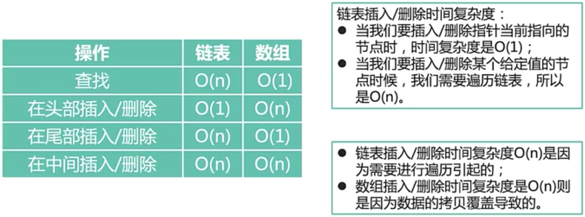

# 1. 算法与数据结构

## 1.1 时间复杂度


## 1.2 二分查找法

最坏时间复杂度O(logn)    

最优时间复杂度O(1)

平均时间复杂度O(logn)

空间复杂度O(1)

<font color="red">先决条件：有序数组</font>

<font color="red">注意数据类型是有范围的，采用L + (R - L) / 2更适合</font>

<font color="red">注意start = mid + 1和end = mid - 1，防止死循环</font>

<font color="red">数据库不可过大，因为数组需要全放内存中</font>

```python
def binary_search(arr, key):
    start = 0
    end = len(arr) - 1
    while start <= end:
        mid = (start + end) / 2
        if arr[mid] < key:
            start = mid + 1
        elif arr[mid] > key:
            end = mid - 1
        else:
            return mid
    return -1


print binary_search([1, 2, 3, 4, 5], 4)

# 输出：3
```

## 1.3 数组&链表

时间复杂度



## 1.4 线性结构与非线性结构

线性结构：数组、栈、队列、链表

非线性结构：二维数组、多维数组、广义表、树结构、图结构

## 1.5 稀疏数组

当一个数组中大部分元素为0，或者为同一个值的数组时，可以使用稀疏数组来保存该数组。

稀疏数组的处理方式是：

1）记录数组<font color=red>一共有几行几列，有多少个不同</font>的值

2）把具有不同值的元素的行列及值记录在一个小规模的数组中，从而<font color=red>缩小程序</font>的规模


### 1.5.1 二维数组转稀疏数组的思路

1、遍历原始的二维数组，得到有效数据的个数sum

2、根据sum就可以创建稀疏数组sparseArr 它的大小int[sum + 1] [3]

3、将二维数组的有效数据存入到稀疏数组中

### 1.5.2 稀疏数组转原始二维数组的思路

1、先读取稀疏数组的第一行，根据第一行的数据创建原始的二维数组

2、在读取稀疏数组后几行的数据，并赋给原始的二维数组即可

### 1.5.3 稀疏数组的代码实现

```java
package com.lzd.algorithms;

public class SparseArray {

    public static void main(String[] args) {

        // 创建一个原始的二维数组 11 * 11
        // 表示没有棋子，1表示黑子 2表示蓝子
        int chessArr1[][] = new int[11][11];
        chessArr1[1][2] = 1;
        chessArr1[2][3] = 2;
        chessArr1[4][5] = 1;
        // 输出原始的二维数组
        System.out.println("原始的二维数组~~");
        for (int[] row : chessArr1) {
            for (int data : row) {
                System.out.printf("%d\t", data);
            }
            System.out.println();
        }

        // 二维数组转成稀疏数组
        // 1.先遍历二维数组 得到非0数据的个数
        int sum = 0;
        for (int i = 0; i < 11; i++) {
            for (int j = 0; j < 11; j++) {
                if (chessArr1[i][j] != 0) {
                    sum++;
                }
            }
        }

        // 2.创建对应的稀疏数组
        int sparseArr[][] = new int[sum + 1][3];
        // 3.给稀疏矩阵赋值
        sparseArr[0][0] = 11;
        sparseArr[0][1] = 11;
        sparseArr[0][2] = sum;
        // 4.遍历二维数组，将非0的值存放到sparseArr中
        int count = 0; // 用于记录是第几个非0数据
        for (int i = 0; i < 11; i++) {
            for (int j = 0; j < 11; j++) {
                if (chessArr1[i][j] != 0) {
                    count++; // 为什么不用i，因为i会遍历每一行，但不一定每一行都有值
                    sparseArr[count][0] = i;
                    sparseArr[count][1] = j;
                    sparseArr[count][2] = chessArr1[i][j];
                }
            }
        }

        // 输出稀疏数组的形式
        System.out.println();
        System.out.println("得到稀疏数组为~~~");
        for (int[] aSparseArr : sparseArr) {
            System.out.printf("%d\t%d\t%d\t\n", aSparseArr[0], aSparseArr[1], aSparseArr[2]);
        }
        System.out.println();

        // 将稀疏数组恢复成原始的二维数组
        int chessArr2[][] = new int[sparseArr[0][0]][sparseArr[0][1]];

        for (int i = 1; i < sparseArr.length; i++) {
            chessArr2[sparseArr[i][0]][sparseArr[i][1]] = sparseArr[i][2];
        }

        System.out.println();
        System.out.println("恢复后的二维数组");

        for (int[] row : chessArr2) {
            for (int data : row) {
                System.out.printf("%d\t", data);
            }
            System.out.println();
        }
    }
}
```

## 1.6 队列

队列是一个有序列表，可以用<font color=red>数组</font>或是<font color=red>链表</font>来实现

### 1.6.1 数组模拟队列代码实现


```java
package com.lzd.algorithms;

public class ArrayQueue {

    public static void main(String[] args) {
    }
}

// 使用数组模拟队列-编写一个ArrayQueue类
class Queue {
    private int maxSize; // 表示数组的最大容量
    private int front; // 队列头
    private int rear; // 队列尾
    private int[] arr; // 该数组用于存放数据，模拟队列

    // 创建队列的构造器
    public Queue(int arrMaxSize) {
        maxSize = arrMaxSize;
        arr = new int[maxSize];
        front = -1;
        rear = -1;
    }

    // 判断队列是否满
    public boolean isFull() {
        return rear == maxSize - 1;
    }

    // 判断队列是否为空
    public boolean isEmpty() {
        return rear == front;
    }

    // 添加数据到队列
    public void addQueue(int n) {
        if (isFull()) {
            System.out.println("队列满，不能加入数据~");
            return;
        }
        rear++;
        arr[rear] = n;
    }

    public int getQueue() {
        if (isEmpty()) {
            throw new RuntimeException("队列空，不能取数据");
        }
        front++;
        return arr[front];
    }

    // 显示队列的所有数据
    public void showQueue() {
        if (isEmpty()) {
            System.out.println("队列为空，没有数据");
            return;
        }
        for (int i = 0; i < arr.length; i++) {
            System.out.printf("arr[%d]=[%d]\n", i, arr[i]);
        }
    }

    // 显示队列的头数据，注意不是取出数据
    public int headQueue() {
        if (isEmpty()) {
            throw new RuntimeException("队列为空，没有数据~~");
        }
        return arr[front + 1];
    }
}
```

<font color=red>问题分析并优化</font>

1）目前数组使用一次就不能用，没有达到复用的效果

2）将这个数组使用算法，改进成一个<font color=red>环形的队列</font> 取模：%

### 1.6.2 数组模拟环形队列代码实现


```java
package com.lzd.algorithms.queue;

public class CircleArrayQueueDemo {

    public static void main(String[] args) {
    }
}

class CircleArray {
    private int maxSize; // 表示数组的最大容量
    private int front; // 队列头
    private int rear; // 队列尾
    private int[] arr; // 该数据用于存放数据，模拟队列

    public CircleArray(int arrMaxSize) {
        maxSize = arrMaxSize;
        arr = new int[maxSize];
    }

    // 判断队列是否满
    public boolean isFull() {
        return (rear + 1) % maxSize == front;
    }

    // 判断队列是否为空
    public boolean isEmpty() {
        return rear == front;
    }

    // 添加数据到队列
    public void addQueue(int n) {
        if (isFull()) {
            System.out.println("队列满，不能加入数据~");
            return;
        }
        // 直接将数据加入
        arr[rear] = n;
        // 将 rear 后移，这里必须考虑取模
        rear = (rear + 1) % maxSize;
    }

    public int getQueue() {
        if (isEmpty()) {
            throw new RuntimeException("队列空，不能取数据");
        }
        // 这里需要分析出front是指向队列的第一个元素
        // 1. 先把front对应的值保留到一个临时变量
        // 2. 将front后移，考虑取模
        int value = arr[front];
        front = (front + 1) % maxSize;
        return value;
    }

    // 显示队列的所有数据
    public void showQueue() {
        if (isEmpty()) {
            System.out.println("队列为空，没有数据");
            return;
        }
        for (int i = front; i < front + size(); i++) {
            System.out.printf("arr[%d]=%d\n", i % maxSize, arr[i % maxSize]);
        }
    }

    // 求出当前队列有效数据的个数
    public int size() {
        return (rear + maxSize - front) % maxSize;
    }

    // 显示队列的头数据，注意不是取出数据
    public int headQueue() {
        if (isEmpty()) {
            throw new RuntimeException("队列为空，没有数据~~");
        }
        return arr[front];
    }
}
```

## 1.7 链表

1. 链表的各个节点在内存中不一定是连续存储的。
2. 链表分带头节点的链表和没有头节点的链表，根据实际的需求来决定的。

### 1.7.1 单链表创建和遍历的分析实现

```java
package com.lzd.algorithms.linkedlist;

public class SingleLinkedListDemo {

    public static void main(String[] args) {
        // 进行测试
        // 先创建节点
        HeroNode hero1 = new HeroNode(1, "宋江", "及时雨");
        HeroNode hero2 = new HeroNode(2, "卢俊义", "玉麒麟");
        HeroNode hero3 = new HeroNode(3, "吴用", "智多星");
        HeroNode hero4 = new HeroNode(4, "林冲", "豹子头");

        SingleLinkedList single = new SingleLinkedList();
        single.add(hero1);
        single.add(hero2);
        single.add(hero3);
        single.add(hero4);

        // 显示一把
        single.list();
    }
}

class SingleLinkedList {
    // 先初始化一个头节点，头节点不要动，不存放具体的数据
    private HeroNode head = new HeroNode(0, "", "");

    // 添加节点到单向链表
    // 思路，当不考虑编号顺序时
    // 1. 找到当前链表的最后节点
    // 2. 将最后这个节点的next 指向新的节点
    public void add(HeroNode heroNode) {

        // 因为head节点不能动，因此我们需要一个辅助变量temp
        HeroNode temp = head;
        // 遍历链表，找到最后
        while (true) {
            // 找到链表的最后
            if (temp.next == null) {
                break;
            }
            // 如果没有找到最后，将temp后移
            temp = temp.next;
        }
        // 当退出while循环时，temp就指向了链表的最后
        temp.next = heroNode;
    }

    // 显示链表（遍历）
    public void list() {
        // 判断链表是否为空
        if (head.next == null) {
            System.out.println("链表为空");
            return;
        }
        // 因为头节点，不能动，因此我们需要一个辅助变量来遍历
        HeroNode temp = head.next;
        while (true) {
            // 判断是否到链表最后
            if (temp == null) {
                break;
            }
            // 输出节点的信息
            System.out.println(temp);
            // 将temp后移，一定小心
            temp = temp.next;
        }
    }
}

// 定义HeroNode，每个HeroNode对象就是一个节点
class HeroNode {
    public int no;
    public String name;
    public String nickname;
    public HeroNode next; // 指向下一个节点

    // 构造器
    public HeroNode(int no, String name, String nickname) {
        this.no = no;
        this.name = name;
        this.nickname = nickname;
    }

    @Override
    public String toString() {
        return "HeroNode{" +
                "no=" + no +
                ", name='" + name + '\'' +
                ", nickname='" + nickname + '\'' +
                '}';
    }
}
```

### 1.7.2 单链表按顺序插入节点


```java
package com.lzd.algorithms.linkedlist;

public class SingleLinkedListDemo {


    public static void main(String[] args) {
        // 进行测试
        // 先创建节点
        HeroNode hero1 = new HeroNode(1, "宋江", "及时雨");
        HeroNode hero2 = new HeroNode(2, "卢俊义", "玉麒麟");
        HeroNode hero3 = new HeroNode(3, "吴用", "智多星");
        HeroNode hero4 = new HeroNode(4, "林冲", "豹子头");

        SingleLinkedList single = new SingleLinkedList();
//        single.add(hero1);
//        single.add(hero2);
//        single.add(hero3);
//        single.add(hero4);

        // 加入按照编号的顺序
        single.addByOrder(hero1);
        single.addByOrder(hero4);
        single.addByOrder(hero2);
        single.addByOrder(hero3);

        // 显示一把
        single.list();
    }
}

class SingleLinkedList {
    // 先初始化一个头节点，头节点不要动，不存放具体的数据
    private HeroNode head = new HeroNode(0, "", "");

    // 添加节点到单向链表
    // 思路，当不考虑编号顺序时
    // 1. 找到当前链表的最后节点
    // 2. 将最后这个节点的next 指向新的节点
    public void add(HeroNode heroNode) {

        // 因为head节点不能动，因此我们需要一个辅助变量temp
        HeroNode temp = head;
        // 遍历链表，找到最后
        while (true) {
            // 找到链表的最后
            if (temp.next == null) {
                break;
            }
            // 如果没有找到最后，将temp后移
            temp = temp.next;
        }
        // 当退出while循环时，temp就指向了链表的最后
        temp.next = heroNode;
    }

    // 第二种方式在添加英雄时，根据排名将英雄插入到指定位置
    // (如果有这个排名，则添加失败，并给出提示)
    public void addByOrder(HeroNode heroNode) {
        // 因为头节点不能动，因此我们仍然通过一个辅助指针（变量）来帮助找到添加的位置
        // 因为单链表，因为我们找的temp是位于添加位置的前一个节点，否则插入不了
        HeroNode temp = head;
        boolean flag = false; // flag标志添加的编号是否存在，默认为false
        while (true) {
            if (temp.next == null) { // 说明temp已经在链表的最后
                break;
            }
            if (temp.next.no > heroNode.no) { // 位置找到，就在temp的后面插入
                break;
            } else if (temp.next.no == heroNode.no) { // 说明希望添加的heroNode的编号已然存在

                flag = true; // 说明编号存在
                break;
            }
            temp = temp.next; // 后移，遍历当前链表
        }
        // 判断flag 的值
        if (flag) { // 不能添加，说明编号存在
            System.out.printf("准备插入的英雄的编号%d 已经存在了, 不能加入\n", heroNode.no);
        } else {
            // 插入到链表中，temp的后面
            heroNode.next = temp.next;
            temp.next = heroNode;
        }
    }

    // 显示链表（遍历）
    public void list() {
        // 判断链表是否为空
        if (head.next == null) {
            System.out.println("链表为空");
            return;
        }
        // 因为头节点，不能动，因此我们需要一个辅助变量来遍历
        HeroNode temp = head.next;
        while (true) {
            // 判断是否到链表最后
            if (temp == null) {
                break;
            }
            // 输出节点的信息
            System.out.println(temp);
            // 将temp后移，一定小心
            temp = temp.next;
        }
    }
}

// 定义HeroNode，每个HeroNode对象就是一个节点
class HeroNode {
    public int no;
    public String name;
    public String nickname;
    public HeroNode next; // 指向下一个节点

    // 构造器
    public HeroNode(int no, String name, String nickname) {
        this.no = no;
        this.name = name;
        this.nickname = nickname;
    }

    @Override
    public String toString() {
        return "HeroNode{" +
                "no=" + no +
                ", name='" + name + '\'' +
                ", nickname='" + nickname + '\'' +
                '}';
    }
}
```

### 1.7.3 单链表节点的修改

```java
package com.lzd.algorithms.linkedlist;

public class SingleLinkedListDemo {


    public static void main(String[] args) {
        // 进行测试
        // 先创建节点
        HeroNode hero1 = new HeroNode(1, "宋江", "及时雨");
        HeroNode hero2 = new HeroNode(2, "卢俊义", "玉麒麟");
        HeroNode hero3 = new HeroNode(3, "吴用", "智多星");
        HeroNode hero4 = new HeroNode(4, "林冲", "豹子头");

        SingleLinkedList single = new SingleLinkedList();
//        single.add(hero1);
//        single.add(hero2);
//        single.add(hero3);
//        single.add(hero4);

        // 加入按照编号的顺序
        single.addByOrder(hero1);
        single.addByOrder(hero4);
        single.addByOrder(hero2);
        single.addByOrder(hero3);
        single.addByOrder(hero3);

        // 显示一把
        single.list();

        // 测试修改节点的代码
        HeroNode newHeroNode = new HeroNode(2, "小卢", "玉麒麟~~");
        single.update(newHeroNode);

        System.out.println("修改后的链表情况");
        single.list();
    }
}

class SingleLinkedList {
    // 先初始化一个头节点，头节点不要动，不存放具体的数据
    private HeroNode head = new HeroNode(0, "", "");

    // 添加节点到单向链表
    // 思路，当不考虑编号顺序时
    // 1. 找到当前链表的最后节点
    // 2. 将最后这个节点的next 指向新的节点
    public void add(HeroNode heroNode) {

        // 因为head节点不能动，因此我们需要一个辅助变量temp
        HeroNode temp = head;
        // 遍历链表，找到最后
        while (true) {
            // 找到链表的最后
            if (temp.next == null) {
                break;
            }
            // 如果没有找到最后，将temp后移
            temp = temp.next;
        }
        // 当退出while循环时，temp就指向了链表的最后
        temp.next = heroNode;
    }

    // 修改节点的信息，根据no编号来修改，即no编号不能空
    // 说明
    // 1.根据newHeroNode的no来修改即可
    public void update(HeroNode newHeroNode) {
        // 判断是否空
        if (head.next == null) {
            System.out.println("链表为空~");
            return;
        }
        // 找到需要修改的节点，根据no编号
        // 定义一个辅助变量
        HeroNode temp = head.next;
        boolean flag = false;
        while (true) {
            if (temp == null) {
                break; // 已经遍历完链表
            }
            if (temp.no == newHeroNode.no) {
                // 找到
                flag = true;
                break;
            }
            temp = temp.next;
        }
        // 根据flag判断是否找到要修改的节点
        if (flag) {
            temp.name = newHeroNode.name;
            temp.nickname = newHeroNode.nickname;
        } else { // 没有找到
            System.out.printf("没有找到编号%d的节点，不能修改\n", newHeroNode.no);
        }
    }

    // 第二种方式在添加英雄时，根据排名将英雄插入到指定位置
    // (如果有这个排名，则添加失败，并给出提示)
    public void addByOrder(HeroNode heroNode) {
        // 因为头节点不能动，因此我们仍然通过一个辅助指针（变量）来帮助找到添加的位置
        // 因为单链表，因为我们找的temp是位于添加位置的前一个节点，否则插入不了
        HeroNode temp = head;
        boolean flag = false; // flag标志添加的编号是否存在，默认为false
        while (true) {
            if (temp.next == null) { // 说明temp已经在链表的最后
                break;
            }
            if (temp.next.no > heroNode.no) { // 位置找到，就在temp的后面插入
                break;
            } else if (temp.next.no == heroNode.no) { // 说明希望添加的heroNode的编号已然存在

                flag = true; // 说明编号存在
                break;
            }
            temp = temp.next; // 后移，遍历当前链表
        }
        // 判断flag 的值
        if (flag) { // 不能添加，说明编号存在
            System.out.printf("准备插入的英雄的编号%d 已经存在了, 不能加入\n", heroNode.no);
        } else {
            // 插入到链表中，temp的后面
            heroNode.next = temp.next;
            temp.next = heroNode;
        }
    }

    // 显示链表（遍历）
    public void list() {
        // 判断链表是否为空
        if (head.next == null) {
            System.out.println("链表为空");
            return;
        }
        // 因为头节点，不能动，因此我们需要一个辅助变量来遍历
        HeroNode temp = head.next;
        while (true) {
            // 判断是否到链表最后
            if (temp == null) {
                break;
            }
            // 输出节点的信息
            System.out.println(temp);
            // 将temp后移，一定小心
            temp = temp.next;
        }
    }
}

// 定义HeroNode，每个HeroNode对象就是一个节点
class HeroNode {
    public int no;
    public String name;
    public String nickname;
    public HeroNode next; // 指向下一个节点

    // 构造器
    public HeroNode(int no, String name, String nickname) {
        this.no = no;
        this.name = name;
        this.nickname = nickname;
    }

    @Override
    public String toString() {
        return "HeroNode{" +
                "no=" + no +
                ", name='" + name + '\'' +
                ", nickname='" + nickname + '\'' +
                '}';
    }
}
```

### 1.7.3 单链表节点的删除和小结


```java
package com.lzd.algorithms.linkedlist;

public class SingleLinkedListDemo {


    public static void main(String[] args) {
        // 进行测试
        // 先创建节点
        HeroNode hero1 = new HeroNode(1, "宋江", "及时雨");
        HeroNode hero2 = new HeroNode(2, "卢俊义", "玉麒麟");
        HeroNode hero3 = new HeroNode(3, "吴用", "智多星");
        HeroNode hero4 = new HeroNode(4, "林冲", "豹子头");

        SingleLinkedList single = new SingleLinkedList();
//        single.add(hero1);
//        single.add(hero2);
//        single.add(hero3);
//        single.add(hero4);

        // 加入按照编号的顺序
        single.addByOrder(hero1);
        single.addByOrder(hero4);
        single.addByOrder(hero2);
        single.addByOrder(hero3);
        single.addByOrder(hero3);

        // 显示一把
        single.list();

        // 测试修改节点的代码
        HeroNode newHeroNode = new HeroNode(2, "小卢", "玉麒麟~~");
        single.update(newHeroNode);

        System.out.println("修改后的链表情况");
        single.list();

        // 删除一个节点
        single.del(1);
        single.del(4);
        single.del(2);
        single.del(3);
        System.out.println("删除后的链表情况");
        single.list();
    }
}

class SingleLinkedList {
    // 先初始化一个头节点，头节点不要动，不存放具体的数据
    private HeroNode head = new HeroNode(0, "", "");

    // 添加节点到单向链表
    // 思路，当不考虑编号顺序时
    // 1. 找到当前链表的最后节点
    // 2. 将最后这个节点的next 指向新的节点
    public void add(HeroNode heroNode) {

        // 因为head节点不能动，因此我们需要一个辅助变量temp
        HeroNode temp = head;
        // 遍历链表，找到最后
        while (true) {
            // 找到链表的最后
            if (temp.next == null) {
                break;
            }
            // 如果没有找到最后，将temp后移
            temp = temp.next;
        }
        // 当退出while循环时，temp就指向了链表的最后
        temp.next = heroNode;
    }

    // 修改节点的信息，根据no编号来修改，即no编号不能空
    // 说明
    // 1.根据newHeroNode的no来修改即可
    public void update(HeroNode newHeroNode) {
        // 判断是否空
        if (head.next == null) {
            System.out.println("链表为空~");
            return;
        }
        // 找到需要修改的节点，根据no编号
        // 定义一个辅助变量
        HeroNode temp = head.next;
        boolean flag = false;
        while (true) {
            if (temp == null) {
                break; // 已经遍历完链表
            }
            if (temp.no == newHeroNode.no) {
                // 找到
                flag = true;
                break;
            }
            temp = temp.next;
        }
        // 根据flag判断是否找到要修改的节点
        if (flag) {
            temp.name = newHeroNode.name;
            temp.nickname = newHeroNode.nickname;
        } else { // 没有找到
            System.out.printf("没有找到编号%d的节点，不能修改\n", newHeroNode.no);
        }
    }

    // 第二种方式在添加英雄时，根据排名将英雄插入到指定位置
    // (如果有这个排名，则添加失败，并给出提示)
    public void addByOrder(HeroNode heroNode) {
        // 因为头节点不能动，因此我们仍然通过一个辅助指针（变量）来帮助找到添加的位置
        // 因为单链表，因为我们找的temp是位于添加位置的前一个节点，否则插入不了
        HeroNode temp = head;
        boolean flag = false; // flag标志添加的编号是否存在，默认为false
        while (true) {
            if (temp.next == null) { // 说明temp已经在链表的最后
                break;
            }
            if (temp.next.no > heroNode.no) { // 位置找到，就在temp的后面插入
                break;
            } else if (temp.next.no == heroNode.no) { // 说明希望添加的heroNode的编号已然存在

                flag = true; // 说明编号存在
                break;
            }
            temp = temp.next; // 后移，遍历当前链表
        }
        // 判断flag 的值
        if (flag) { // 不能添加，说明编号存在
            System.out.printf("准备插入的英雄的编号%d 已经存在了, 不能加入\n", heroNode.no);
        } else {
            // 插入到链表中，temp的后面
            heroNode.next = temp.next;
            temp.next = heroNode;
        }
    }

    // 删除节点
    // 思路
    // 1. head不能动，因此我们需要一个temp辅助节点找到待删除节点的前一个节点
    // 2. 说明我们在比较时，是temp.next.no 和 需要删除的节点的no比较
    public void del(int no) {
        HeroNode temp = head;
        boolean flag = false; // 标志是否找到待删除节点
        while (true) {
            if (temp.next == null) { // 已经到链表的最后
                break;
            }
            if (temp.next.no == no) {
                // 找到的待删除节点的前一个节点temp
                flag = true;
                break;
            }
            temp = temp.next; // temp后移
        }
        if (flag) {
            // 可以删除
            temp.next = temp.next.next;
        } else {
            System.out.printf("要删除的%d节点不存在", no);
        }
    }

    // 显示链表（遍历）
    public void list() {
        // 判断链表是否为空
        if (head.next == null) {
            System.out.println("链表为空");
            return;
        }
        // 因为头节点，不能动，因此我们需要一个辅助变量来遍历
        HeroNode temp = head.next;
        while (true) {
            // 判断是否到链表最后
            if (temp == null) {
                break;
            }
            // 输出节点的信息
            System.out.println(temp);
            // 将temp后移，一定小心
            temp = temp.next;
        }
    }
}

// 定义HeroNode，每个HeroNode对象就是一个节点
class HeroNode {
    public int no;
    public String name;
    public String nickname;
    public HeroNode next; // 指向下一个节点

    // 构造器
    public HeroNode(int no, String name, String nickname) {
        this.no = no;
        this.name = name;
        this.nickname = nickname;
    }

    @Override
    public String toString() {
        return "HeroNode{" +
                "no=" + no +
                ", name='" + name + '\'' +
                ", nickname='" + nickname + '\'' +
                '}';
    }
}
```

### 1.7.4 单链表（新浪面试题）

#### 1.7.4.1 统计单链表中的个数

```java
		// 方法：获取到单链表的节点的个数(如果是带头结点的链表，需要不统计头节点)
    public static int getLength(HeroNode head) {
        if (head.next == null) { // 空链表
            return 0;
        }
        int length = 0;
        // 定义一个辅助变量，这里我们没有统计头节点
        HeroNode cur = head.next;
        while (cur != null) {
            length++;
            cur = cur.next; // 遍历
        }
        return length;
    }
```

#### 1.7.4.2 查找单链表中的倒数第K个节点（新浪面试题）

```java
/**
     * 思路
     * 1.编写一个方法，接收head节点，同时接收一个index
     * 2.index表示是倒数第index个节点
     * 3.先把链表从头到尾遍历，得到链表的总的长度 getLength
     * 4.得到size后，我们从链表的第一个开始遍历(size - index)个，就可以得到
     * 5.如果找到了，则返回该节点，否则返回null
     */
    public static HeroNode findLastIndexNode(HeroNode head, int index) {
        // 判断如果链表为空，返回null
        if (head.next == null) {
            return null; // 没有找到
        }
        // 第一个遍历得到链表的长度（节点个数）
        int size = getLength(head);
        // 第二次遍历 size - index位置，就是我们倒数的第k个节点
        // 先做一个index的校验
        if (index <= 0 || index > size) {
            return null;
        }
        // 定义给辅助变量，for循环定位到倒数的index
        HeroNode cur = head.next;
        for (int i = 0; i < size - index; i++) {
            cur = cur.next;
        }
        return cur;
    }
```

### 1.7.5 单链表反转（腾讯面试题）

<font color=red>思路：</font>

1.先定义一个节点reverseHead = new HeroNode();

2.从头到尾遍历原来的链表，每遍历一个节点，就将其取出，并放在新的链表reverseHead的最前端

3.原来的链表的head.next = reverseHead.next

```java
// 将单链表反转
    public static void reversetList(HeroNode head) {
        // 如果当前链表为空，或者只有一个节点，无需反转，直接返回
        if (head.next == null || head.next.next == null) {
            return;
        }
        // 定义一个辅助指针（变量），帮助我们遍历原来的链表
        HeroNode cur = head.next;
        HeroNode next = null; // 指向当前节点[cur]的下一个节点
        HeroNode reverseHead = new HeroNode(0, "", "");
        // 遍历原来的链表，每遍历一个节点，就将其取出，并放在新的链表reverseHead的最前端
        // 动脑筋
        while (cur != null) {
            next = cur.next; // 先暂时保存一下当前节点的下一个节点，因为后面需要使用
            cur.next = reverseHead.next; // 将cur的下一个节点指向新的链表的最前端
            reverseHead.next = cur; // 将cur连接到新的链表上
            cur = next; // 让cur后移
        }
        // 将head.next指向reverseHead.next, 实现单链表的反转
        head.next = reverseHead.next;
    }
```

<font color=red>总结：</font>

B插入A的后面

```java
B.next = A.next

A.next = B
```

### 1.7.6 单链表（百度面试题）

题目：逆序打印单链表

思路：

1.方式一：先将单链表进行反转操作，然后再遍历即可，这样做的问题是会破坏原来的单链表的结构，不建议

2.方式二：<font color=gree>可以利用栈这个数据结构，将各个节点压入到栈中，然后利用栈的先进后出的特点，就实现了逆序打印的效果</font>

```java
// 可以利用栈这个数据结构，将各个节点压入到栈中，然后利用栈的先进先出的特点，就实现了逆序打印的结果
    public static void reversePrint(HeroNode head) {
        if (head.next == null) {
            return;
        }
        Stack<HeroNode> stack = new Stack<>();
        HeroNode cur = head.next;
        while (cur != null) {
            stack.push(cur);
            cur = cur.next;
        }
        while (stack.size() > 0) {
            System.out.println(stack.pop());
        }
    }
```

### 1.7.7 双向链表


```java
package com.lzd.algorithms.linkedlist;

public class DoubleLinkedListDemo {

    public static void main(String[] args) {

    }
}

// 创建一个双向链表的类
class DoubleLinkedList {
    // 先初始化一个头节点，头节点不要动，不存放具体的数据
    private HeroNode2 head = new HeroNode2(0, "", "");

    // 返回头节点
    public HeroNode2 getHead() {
        return head;
    }

    // 显示链表（遍历）
    public void list() {
        // 判断链表是否为空
        if (head.next == null) {
            System.out.println("链表为空");
            return;
        }
        // 因为头节点，不能动，因此我们需要一个辅助变量来遍历
        HeroNode2 temp = head.next;
        while (true) {
            // 判断是否到链表最后
            if (temp == null) {
                break;
            }
            // 输出节点的信息
            System.out.println(temp);
            // 将temp后移，一定小心
            temp = temp.next;
        }
    }

    // 添加一个节点到双向链表的最后
    public void add(HeroNode2 heroNode) {
        // 因为head节点不能动，因此我们需要一个辅助变量temp
        HeroNode2 temp = head;
        // 遍历链表，找到最后
        while (true) {
            // 找到链表的最后
            if (temp.next == null) {
                break;
            }
            // 如果没有找到最后，将temp后移
            temp = temp.next;
        }
        // 形成一个双向链表
        temp.next = heroNode;
        heroNode.pre = temp;
    }

    // 双向链表的节点内容修改和单向链表一样
    public void update(HeroNode2 newHeroNode) {
        // 判断是否空
        if (head.next == null) {
            System.out.println("链表为空~");
            return;
        }
        // 找到需要修改的节点，根据no编号
        // 定义一个辅助变量
        HeroNode2 temp = head.next;
        boolean flag = false;
        while (true) {
            if (temp == null) {
                break; // 已经遍历完链表
            }
            if (temp.no == newHeroNode.no) {
                // 找到
                flag = true;
                break;
            }
            temp = temp.next;
        }
        // 根据flag判断是否找到要修改的节点
        if (flag) {
            temp.name = newHeroNode.name;
            temp.nickname = newHeroNode.nickname;
        } else { // 没有找到
            System.out.printf("没有找到编号%d的节点，不能修改\n", newHeroNode.no);
        }
    }

    // 1.对于双向链表，我们可以直接找到要删除的这个节点
    // 2.找到后，自我删除即可
    public void del(int no) {
        // 判断当前链表是否为空
        if (head.next == null) {
            System.out.println("链表为空，无法删除");
            return;
        }

        HeroNode2 temp = head.next; // 单链表 HeroNode temp = head; 因为原先要找到待删除节点的前一个节点
        boolean flag = false; // 标志是否找到待删除节点

        while (true) {
            if (temp == null) { // 已经到链表的最后节点的next
                break;
            }
            if (temp.no == no) {
                // 找到的待删除节点的前一个节点temp
                flag = true;
                break;
            }
            temp = temp.next; // temp后移
        }
        if (flag) {
            // 可以删除
            temp.pre.next = temp.next;
            // 如果是最后一个节点，就不需要执行下面这句话，否则会出现空指针异常
            if (temp.next != null) {
                temp.next.pre = temp.pre;
            }
        } else {
            System.out.printf("要删除的%d节点不存在", no);
        }
    }
}

// 定义HeroNode，每个HeroNode对象就是一个节点
class HeroNode2 {
    public int no;
    public String name;
    public String nickname;
    public HeroNode2 next; // 指向下一个节点
    public HeroNode2 pre;

    // 构造器
    public HeroNode2(int no, String name, String nickname) {
        this.no = no;
        this.name = name;
        this.nickname = nickname;
    }

    @Override
    public String toString() {
        return "HeroNode{" +
                "no=" + no +
                ", name='" + name + '\'' +
                ", nickname='" + nickname + '\'' +
                '}';
    }
}
```

### 1.7.8 环形链表介绍和约瑟夫问题


### 1.7.9 约瑟夫问题分析图解和实现

#### 1.7.9.1 单向循环链表的构建与遍历


```java
package com.lzd.algorithms.linkedlist;

public class Josepfu {

    public static void main(String[] args) {
        CircleSingleLinkedList list = new CircleSingleLinkedList();
        list.addBoy(5);
        list.showBoy();
    }
}

class CircleSingleLinkedList {

    private Boy first = null;

    public void addBoy(int nums) {
        if (nums < 1) {
            return;
        }

        Boy curBoy = null;

        for (int i = 1; i <= nums; i++) {
            Boy boy = new Boy(i);
            if (i == 1) {
                first = boy;
                first.setNext(first);
                curBoy = first;
            } else {
                curBoy.setNext(boy);
                boy.setNext(first);
                curBoy = boy; // cuyBoy后移
            }
        }
    }

    public void showBoy() {
        if (first == null) {
            return;
        }

        Boy curBoy = first;

        while (true) {
            System.out.printf("小孩的编号 %d \n", curBoy.getNo());

            if (curBoy.getNext() == first) {
                break;
            }

            curBoy = curBoy.getNext(); // 后移
        }
    }
}

class Boy {
    private int no;
    private Boy next;

    public Boy(int no) {
        this.no = no;
    }

    public int getNo() {
        return no;
    }

    public void setNo(int no) {
        this.no = no;
    }

    public Boy getNext() {
        return next;
    }

    public void setNext(Boy next) {
        this.next = next;
    }
}
```

#### 1.7.9.2 约瑟夫出圈


```java
package com.lzd.algorithms.linkedlist;

public class Josepfu {

    public static void main(String[] args) {
        CircleSingleLinkedList list = new CircleSingleLinkedList();
        list.addBoy(5);
        list.showBoy();

        //测试一把小孩出圈是否正确
        list.countBoy(1, 2, 5); // 2->4->1->5->3
    }
}

class CircleSingleLinkedList {

    private Boy first = null;

    public void addBoy(int nums) {
        if (nums < 1) {
            return;
        }

        Boy curBoy = null;

        for (int i = 1; i <= nums; i++) {
            Boy boy = new Boy(i);
            if (i == 1) {
                first = boy;
                first.setNext(first);
                curBoy = first;
            } else {
                curBoy.setNext(boy);
                boy.setNext(first);
                curBoy = boy; // cuyBoy后移
            }
        }
    }

    public void showBoy() {
        if (first == null) {
            return;
        }

        Boy curBoy = first;

        while (true) {
            System.out.printf("小孩的编号 %d \n", curBoy.getNo());

            if (curBoy.getNext() == first) {
                break;
            }

            curBoy = curBoy.getNext(); // 后移
        }
    }

    // 根据用户的输入，计算出小孩出圈的顺序

    /**
     * @param startNo  表示从第几个小孩开始数数
     * @param countNum 表示数几下
     * @param nums     表示最初有多少小孩在圈中
     */
    public void countBoy(int startNo, int countNum, int nums) {
        // 先对数据进行校验
        if (first == null || startNo < 1 || startNo > nums) {
            System.out.println("参数输入有误， 请重新输入");
            return;
        }
        // 创建要给辅助指针,帮助完成小孩出圈
        Boy helper = first;
        // 需求创建一个辅助指针(变量) helper , 事先应该指向环形链表的最后这个节点
        while (true) {
            if (helper.getNext() == first) { // 说明helper指向最后小孩节点
                break;
            }
            helper = helper.getNext();
        }
        //小孩报数前，先让 first 和  helper 移动 k - 1次
        for (int j = 0; j < startNo - 1; j++) {
            first = first.getNext();
            helper = helper.getNext();
        }
        //当小孩报数时，让first 和 helper 指针同时 的移动  m  - 1 次, 然后出圈
        //这里是一个循环操作，知道圈中只有一个节点
        while (true) {
            if (helper == first) { //说明圈中只有一个节点
                break;
            }
            //让 first 和 helper 指针同时 的移动 countNum - 1
            for (int j = 0; j < countNum - 1; j++) {
                first = first.getNext();
                helper = helper.getNext();
            }
            //这时first指向的节点，就是要出圈的小孩节点
            System.out.printf("小孩%d出圈\n", first.getNo());
            //这时将first指向的小孩节点出圈
            first = first.getNext();
            helper.setNext(first); //

        }
        System.out.printf("最后留在圈中的小孩编号%d \n", first.getNo());

    }
}

class Boy {
    private int no;
    private Boy next;

    public Boy(int no) {
        this.no = no;
    }

    public int getNo() {
        return no;
    }

    public void setNo(int no) {
        this.no = no;
    }

    public Boy getNext() {
        return next;
    }

    public void setNext(Boy next) {
        this.next = next;
    }
}
```

## 1.8 栈的应用场景和介绍


## 排序算法

### 排序算法的介绍


### 时间复杂度

#### 忽略常数项


#### 忽略低次项


#### 忽略系数


这里可能有问题？

### 常见的算法复杂度


#### 常数阶O(1)


#### 对数阶O($\log_2n$)


#### 线性阶O(n)


#### 线性对数阶O($nlogN$)


#### 平方阶O($n^2$)


#### 	平均时间复杂度和最坏时间复杂度


### 空间复杂度


### 种类

#### 冒泡排序

##### 基本介绍


##### 思路分析


（3）如果我们发现在某躺排序中，没有发生一次交换，可以提前结束冒泡排序。（优化）

##### 代码

```java
package com.lzd.algorithms.sort;

import java.util.Arrays;

public class BubbleSort {

    public static void main(String[] args) {

        int arr[] = {3, 9, -1, 10, -2};

        // 第一趟排序，就是将最大的数排在最后
        int temp = 0;
        for (int i = 0; i < arr.length - 1; i++) {

            for (int j = 0; j < arr.length - 1 - i; j++) {

                if (arr[j] > arr[j + 1]) {
                    temp = arr[j];
                    arr[j] = arr[j + 1];
                    arr[j + 1] = temp;
                }
            }
            System.out.println("第" + (i + 1) + "趟排序后的数组");
            System.out.println(Arrays.toString(arr));
        }
    }
}
```

优化

```java
package com.lzd.algorithms.sort;

import java.util.Arrays;

public class BubbleSort {

    public static void main(String[] args) {

        int arr[] = {3, 9, -1, 10, 20};

        bubbleSort(arr);

        System.out.println("排序后：" + Arrays.toString(arr));
    }


    private static void bubbleSort(int[] arr) {
        // 第一趟排序，就是将最大的数排在最后
        int temp;
        boolean flag = false;
        for (int i = 0; i < arr.length - 1; i++) {
          
            for (int j = 0; j < arr.length - 1 - i; j++) {

                if (arr[j] > arr[j + 1]) {
                    flag = true;

                    temp = arr[j];
                    arr[j] = arr[j + 1];
                    arr[j + 1] = temp;
                }
            }
            System.out.println("第" + (i + 1) + "趟排序后的数组");
            System.out.println(Arrays.toString(arr));

            if (!flag) { // 在一趟排序中，一次交换都没有发生
                break;
            }
            flag = false;
        }
    }
}
```

#### 选择排序

```java
package com.lzd.algorithms.sort;

import java.util.Arrays;

public class SelectSort {

    public static void main(String[] args) {

        int[] arr = {3, 1, 7, 5, -1};
        selectSort(arr);
        System.out.println(Arrays.toString(arr));
    }

    private static void selectSort(int[] arr) {

        for (int i = 0; i < arr.length - 1; i++) {

            int minIdx = i;
            int minVal = arr[i]; // minVal相当于空瓶子

            for (int j = i + 1; j < arr.length; j++) {

                if (min > arr[j]) {
                    minVal = arr[j];
                    minIdx = j;
                }
            }

            // 一轮过后 选出了最小值 交换
            if (i != minIdx) { // 如果最小值没有变化 说明没有移动 顺序是刚好的
                arr[minIdx] = arr[i];
                arr[i] = minVal;
            }
        }
    }
}
```

时间复杂度为O($n^2$)，不稳定。选择排序就是每次从未排序的元素里选择出最小的值和下标进行交换。

#### 插入排序

```java
public static void sort(int[] arr) {
    for (int i = 1; i < arr.length; i++) {
        int insertVal = arr[i]; // 未排好序的元素里要插入的值
        int j = i; // 从排好序的最后边开始，找到比其小的数
        while (j > 0 && insertVal < arr[j - 1]) {
            arr[j] = arr[j - 1];
            j--;
        }
        arr[j] = insertVal; // insertVal相当于空瓶子
    }
}
```

#### 快速排序


# 2. 算法题

##  2.1 数组

###  2.1.1 TwoSum（第1题-简单）

```
描述：
Input: nums = [2,7,11,15], target = 9
Output: [0,1]
Output: Because nums[0] + nums[1] == 9, we return [0, 1].
```

```python
from typing import List


def twoSum(nums: List[int], target: int) -> List[int]:
    nums_list = enumerate(nums)
    for idx, n in nums_list:
        if (target - n) in nums[idx + 1:]:
            return [idx, nums[idx + 1:].index(target - n) + idx + 1]
    return None


print(twoSum([2, 7, 11, 15], 9))
# 输出：[0, 1]
```

### 2.1.2 最大子序和（第53题-简单）

```java
描述：
输入：nums = [-2,1,-3,4,-1,2,1,-5,4]
输出：6
解释：连续子数组 [4,-1,2,1] 的和最大，为 6 。
```

#### 暴力法

```java
package com.lzd.algorithms;

public class MaxSubArray {

    public static void main(String[] args) {

        int[] nums = new int[]{-2, 1, -3, 4, -1, 2, 1, -5, 4};

        System.out.println(maxSubArray(nums));
    }

    private static int maxSubArray(int[] nums) {

        int max = nums[0];

        for (int i = 0; i < nums.length; i++) {

            int sum = 0;

            for (int j = i; j < nums.length; j++) {

                sum += nums[j];

                max = Math.max(max, sum);
            }

        }

        return max;
    }
}
```

#### 分治法

```java

```

#### 动态规划

```java

```

### 2.1.3 买卖股票的最佳时机 （第121题-简单）

```java
给定一个数组 prices ，它的第 i 个元素 prices[i] 表示一支给定股票第 i 天的价格。

你只能选择 某一天 买入这只股票，并选择在 未来的某一个不同的日子 卖出该股票。设计一个算法来计算你所能获取的最大利润。

返回你可以从这笔交易中获取的最大利润。如果你不能获取任何利润，返回 0 。
  
示例 1：
输入：[7,1,5,3,6,4]
输出：5
解释：在第 2 天（股票价格 = 1）的时候买入，在第 5 天（股票价格 = 6）的时候卖出，最大利润 = 6-1 = 5 。
     注意利润不能是 7-1 = 6, 因为卖出价格需要大于买入价格；同时，你不能在买入前卖出股票。
  
示例 2：
输入：prices = [7,6,4,3,1]
输出：0
解释：在这种情况下, 没有交易完成, 所以最大利润为 0。
```

<font color=red>动态规划解法</font>

```java
package com.lzd.algorithms;

public class Stock {

    public static void main(String[] args) {

        int[] prices = new int[]{7, 1, 5, 3, 6, 4};
        System.out.println(maxProfit(prices));
    }

    private static int maxProfit(int[] prices) {
        int max = 0;
        int minPrice = prices[0];

        for (int i = 1; i < prices.length; i++) {
            minPrice = Math.min(prices[i], minPrice);
            max = Math.max(max, prices[i] - minPrice);
        }

        return max;
    }
}
```

### 2.1.4 多数元素（第169题-简单）

```java
给定一个大小为 n 的数组，找到其中的多数元素。多数元素是指在数组中出现次数 大于 ⌊ n/2 ⌋ 的元素。
你可以假设数组是非空的，并且给定的数组总是存在多数元素。

示例 1：
输入：[3,2,3]
输出：3
示例 2：

输入：[2,2,1,1,1,2,2]
输出：2
```

```java
package com.lzd.algorithms;

import java.util.Arrays;

public class Algo169 {

    public static void main(String[] args) {
        int[] nums = new int[]{2, 2, 1, 1, 1, 2, 2};
        System.out.println(majorityElement(nums));
    }

    private static int majorityElement(int[] nums) {
        Arrays.sort(nums);
        return nums[nums.length - 1];
    }
}
```

## 2.2 链表

### 2.2.1 合并两个有序链表（第21题-简单）

```java
将两个升序链表合并为一个新的 升序 链表并返回。新链表是通过拼接给定的两个链表的所有节点组成的。 
  
示例 1：
输入：l1 = [1,2,4], l2 = [1,3,4]
输出：[1,1,2,3,4,4]
  
示例 2：
输入：l1 = [], l2 = []
输出：[]
  
示例 3：
输入：l1 = [], l2 = [0]
输出：[0]
```


