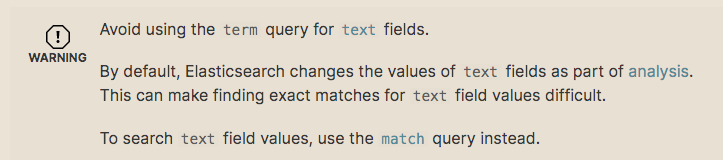
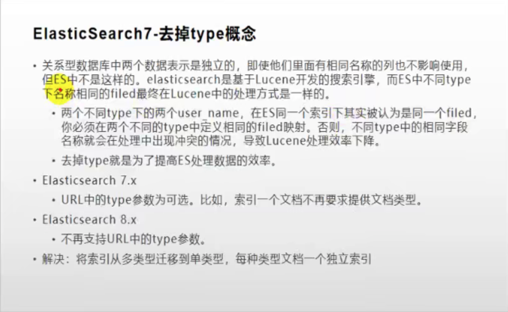

# Elasticsearch

全文搜索属于最常用的需求，开源的Elasticsearch是目前全文搜索引擎的首选。

它可以快速地储存、搜索和分析海量数据。维基百科、Stack Overflow、GitHub都采用它。

数据来源于MySQL，需要将MySQL的数据在Elasticsearch中存一份。

Elastic的底层是开源库Lucene。但是，你没法直接用Lucene，必须自己去写代码去调用它的接口。Elastic是Lucene的封装，提供了REST API的操作接口，开箱即用。

REST API：天然的跨平台。

## 基本概念

1、Index（索引）

动词，相当于MySQL中的insert；

名词，相当于MySQL中的Database

2、Type（类型）<font color=red>7.0版本以后去掉了type</font>

在Index（索引）中，可以定义一个或多个类型。

类似于MySQL中Table；每一种类型的数据放在一起；

3、Document（文档）

保存在某个索引（Index）下，某种类型（Type）的一个数据（Document），文档是JSON格式的，Document就像是MySQL中的某个Table里面的内容；

## Docker安装

### 下载安装镜像

```shell
docker pull elasticsearch:7.4.2		存储和检索数据
docker pull kibana:7.4.2		可视化检索数据
```

### 创建实例

#### 设置Elasticsearch

```shell
mkdir -p /mydata/elasticsearch/config
mkdir -p /mydata/elasticsearch/data
// 表示所有远程机器都能访问 冒号后面需要有空格
echo "http.host: 0.0.0.0" >> /mydata/elasticsearch/config/elasticsearch.yml
chmod -R 777 /mydata/elasticsearch/
```

#### 启动Elasticsearch

```shell
// 9200后来发送http请求REST API时用到的 9300是在分布式集群节点下各服务器之间通信的端口
docker run --name elasticsearch -p 9200:9200 -p 9300:9300 \
-e "discovery.type=single-node" \
-e ES_JAVA_OPTS="-Xms64m -Xmx512m" \
-v /mydata/elasticsearch/config/elasticsearch.yml:/usr/share/elasticsearch/config/elasticsearch.yml \
-v /mydata/elasticsearch/data:/usr/share/elasticsearch/data \
-v  /mydata/elasticsearch/plugins:/usr/share/elasticsearch/plugins \
-d elasticsearch:7.4.2 
```

会启动不成功，使用docker logs elasticsearch查看日志

可以使用"docker start 镜像名"重新启动

#### 开机启动Elasticsearch

```shell
docker update elasticsearch --restart=always
```

#### 启动Kibana

```shell
docker run --name kibana -e ELASTICSEARCH_HOSTS=http://192.168.0.192:9200 -p 5601:5601 -d kibana:7.4.2
或 下面的可用
docker run -d -p 5601:5601 --link elasticsearch --name kibana -e "ELASTICSEARCH_URL=http://192.168.0.192:9200" kibana:7.4.2
```

<font color="red">如果http://192.168.0.192:5601/启动不了，可能是容器之间有防火墙，通信不了，执行以下命令</font>

参考：https://blog.csdn.net/whatday/article/details/107879989

```shell
nmcli connection modify docker0 connection.zone trusted
 
systemctl stop NetworkManager.service
 
firewall-cmd --permanent --zone=trusted --change-interface=docker0
 
systemctl start NetworkManager.service
 
nmcli connection modify docker0 connection.zone trusted
 
systemctl restart docker.service
```

#### 开机启动Kibana

```shell
docker update kibana  --restart=always
```

## 初步检索

### _cat

```java
GET /_cat/nodes: 查看所有节点
GET /_cat/health: 查看es健康状况
GET /_cat/master: 查看主节点
GET /_cat/indices: 查看所有索引		show databases;
```

### 索引一个文档（保存）

保存一个数据，保存在哪个索引的哪个类型下，指定用哪个唯一标识

PUT customer/external/1 在customer索引下的external类型下保存1号数据

```java
PUT customer/external/1
{
  "name":"John Doe"
}
```

```java
PUT和POST都可以
POST：新增。如果不指定id，会自动生成id。指定ID就会修改这个数据，并新增版本号
PUT：可以新增可以修改。PUT必须指定id；由于PUT需要指定ID，我们一般都用来做修改操作，不指定ID会报错。
```

### 查询文档

```java
GET customer/external/1
查询结果
{
    "_index": "customer",
    "_type": "external",
    "_id": "1",
    "_version": 2,
    "_seq_no": 1,				// 并发控制字段，每次更新就会+1，用来做乐观锁
    "_primary_term": 1,	// 同上，主分片重新分配，如重启，就会变化
    "found": true,
    "_source": {
        "name": "John Doe"
    }
}
更新携带 ?if_seq_no=0&if_primary_term=1
```

### 更新文档

```java
POST customer/external/1/_update		// 对比原来数据，与原来一样就什么都不做，version和seq_no都不变
{
  "doc":{
    "name":"John Doew"
  }
}
或者
POST customer/external/1		// 内容一样也会更新，version和seq_no会一直增加
{
  "name":"John Doe2"
}
或者
PUT customer/external/1		// 内容一样也会更新，version和seq_no会一直增加
{
  "name":"John Doe"
}

更新同时增加属性
POST customer/external/1/_update
{
  "doc":{"name":"Jane Doe","age":20}
}

PUT和POST不带_update也是可以的
```

### 删除文档&索引

```java
DELETE customer/external/1
DELETE customer
// 没有删除类型的操作 只能删除索引或者把类型下的数据都清空
```

### bulk批量API

```java
POST /customer/external/_bulk
// index表示保存操作 批量操作在postman里没法操作 只能使用kibana
{"index":{"_id":"1"}} 
{"name":"John Doe"}
{"index":{"_id":"2"}}
{"name":"Jane Doe"}
```

复杂示例

```java
POST /_bulk
{"delete":{"_index":"website","_type":"blog","_id":"123"}}
{"create":{"_index":"website","_type":"blog","_id":"123"}}
{"title":"my first blog post"}
{"index":{"_index":"website","_type":"blog"}}
{"title":"my second blog post"}
{"update":{"_index":"website","_type":"blog","_id":"123"}}
{"doc":{"title":"my updated blog post"}}
```

### 样本测试数据

```java
POST /bank/account/_bulk
```

https://github.com/elastic/elasticsearch/blob/master/docs/src/test/resources/accounts.json ，导入测试数据

## 进阶检索

### SearchAPI

ES支持两种基本方式检索：

1.一个是通过使用 REST request URI 发送搜索参数（URI+检索参数）

2.另一个是通过使用 REST request body 来发送它们（URI+请求体）

#### 检索信息

一切检索从_search开始

```java
GET bank/_search																// 检索bank下所有信息，包括type和docs
GET bank/_search?q=*&sort=account_number:asc		// 请求参数方式检索
```

```java
GET /bank/_search
{
  "query": { "match_all": {} },
  "sort": [
    { "account_number": "asc" }
  ],
  "from": 10,
  "size": 10
}
```

### Query DSL

#### 返回部分字段

```java
// 使用 "_source":["balance","firstname"]
GET /bank/_search
{
  "query": {
    "match_all": {}
  },
  "sort": [
    {
      "balance": "desc"
    }
  ],
  "from":5,
  "size":5,
  "_source": ["balance","firstname"]
}
```

#### 全文检索

全文检索按照评分进行排序，会对检索条件进行分词匹配

#### match_phrase【短语匹配】

```java
GET /bank/_search
{
  "query": { "match_phrase": { "address": "mill lane" } }
}
```

#### multi_match【多字段匹配】

```java
GET bank/_search
{
  "query": {
    "multi_match": {
      "query": "mill",
      "fields": ["address","city"]
    }
  }
}
```

#### bool【复合查询】

```java
GET /bank/_search
{
  "query": {
    "bool": {
      "must": [
        { "match": { "age": "40" } }
      ],
      "must_not": [
        { "match": { "state": "ID" } }
      ]
    }
  }
}
```

#### filter【结果过滤】

```java
GET /bank/_search
{
  "query": {
    "bool": {
      "must": { "match_all": {} },
      "filter": {
        "range": {
          "balance": {
            "gte": 20000,
            "lte": 30000
          }
        }
      }
    }
  }
}
```

#### term【查询】

<font color="red">和match一样。匹配某个属性的值。全文检索字段用match，其他非text字段匹配用term。</font>

```java
GET /_search
{
    "query": {
        "term": {
            "user": {
                "value": "Kimchy",
                "boost": 1.0
            }
        }
    }
}
```

精确匹配

```java
GET /bank/_search
{
  "query": {
    "match": {
      "address.keyword": 20
    }
  }
}
```

match_phrase与match "address.keyword"区别

```java
GET bank/_search
{
  "query": {
    "match_phrase": { 
      "address": "132 Gunnison" // 包含132 Gunnison的都能查出来
    }
  }
}

GET bank/_search
{
  "query": {
    "match": {
      "address.keyword": "132 Gunnison" // 等值匹配查询 等于132 Gunnison才能查出来
    }
  }
}
```

<font color=red>总结：值为文本的用match查询，非文本则用term查询，比如年龄，薪资</font>



#### aggregations【聚合】

聚合提供了从数据中分组和提取数据的能力。最简单的聚合方法大致等于**SQL GROUP BY**和**SQL**聚合函数。在**Elasticsearch**中，您有执行搜索返回**hits**（命中结果），并且同时返回聚合结果，把一个响应中的所有**hits**（命中结果）分隔开的能力。这是非常强大且有效的，您可以执行查询和多个聚合，并且在一次使用中得到各自的（任何一个的）返回结果，使用一次简洁和简化的API来避免网络往返。

**搜索address中包含mill的所有人的年龄分布以及平均年龄，但不显示这些人的详情。**

```java
GET bank/_search
{
  "query": {
    "match": {
      "address": "mill"
    }
  },
  "aggs": {
    "ageAgg": {
      "terms": {
        "field": "age",
        "size": 10 // 如果有100种可能，只取前10种可能
      }
    },
    "ageAvg":{
      "avg": {
        "field": "age"
      }
    },
    "balanceAvg":{
      "avg": {
        "field": "balance"
      }
    }
  },
  "size": 0 // 不看hits结果，只看聚合结果
}
```

**复杂-按照年龄聚合，并且请求这些年龄段的这些人的平均薪资:**

```java
GET bank/_search
{
  "query": {
    "match_all": {}
  },
  "aggs": {
    "ageAgg": {
      "terms": {
        "field": "age",
        "size": 100
      },
      "aggs": {
        "ageAvg": {
          "avg": {
            "field": "balance"
          }
        }
      }
    }
  }
}
```

**复杂-查出所有年龄分布，并且这些年龄段中M的平均薪资和F的平均薪资以及这个年龄段的总体平均薪资**

```java
GET bank/_search
{
  "query": {
    "match_all": {}
  },
  "aggs": {
    "ageAgg": {
      "terms": {
        "field": "age",
        "size": 100
      },
      "aggs": {
        "genderAgg": {
          "terms": {
            "field": "gender.keyword", // 文本字段聚合的时候，需要写上keyword进行精确匹配
            "size": 10
          },
          "aggs": {
            "balanceAvg": {
              "avg": {
                "field": "balance"
              }
            }
          }
        },
        "ageBalanceAvg":{
          "avg": {
            "field": "balance"
          }
        }
      }
    }
  }
}
```

### Mapping

#### 创建映射



<font color="red">创建一个索引并指定映射</font>（类似于MYSQL创建表字段类型）

```java
PUT /my_index
{
  "mappings": {
    "properties": {
      "age":{"type": "integer"},
      "email":{"type": "keyword"},
      "name":{"type": "text"}
    }
  }
}
```

#### 添加新的字段映射

```java
PUT my_index/_mapping
{
  "properties":{
    "employee-id":{
      "type": "keyword",
      "index": false
    }
  }
}
```

#### 更新映射

<font color="red">对于已经存在的映射字段，我们不能更新。更新必须创建新的索引进行数据迁移</font>

#### 数据迁移

先创建出new_twitter的正确映射。然后使用如下方式进行数据迁移

6.0以后没有type的写法

```java
POST _reindex	【固定写法】
{
  "source":{
    "index":"twitter"
  },
  "dest":{
    "index":"new_twitter"
  }
}
```

6.0之前有type的写法

```java
POST _reindex
{
  "source":{
    "index":"twitter",
    "type":"tweet"
  },
  "dest":{
    "index":"tweets"
  }
}
```

### 分词

```java
POST _analyze
{
  "tokenizer": "standard",
  "text": "The 2 QUICK Brown-Foxes jumped over the lazy dog's bone."
}
```

#### 安装ik分词器

es默认都是对英文进行分词，中文分词需要安装自己的分词器

**注意**:	不能用默认 elasticsearch-plugin install xxx.zip 进行自动安装

```java
https://github.com/medcl/elasticsearch-analysis-ik/releases?after=v6.4.2
```

对应es版本安装

```java
进入es容器内部plugins目录
docker exec -it 容器id /bin/bash
wget
https://github.com/medcl/elasticsearch-analysis-ik/releases/download/v7.4.2/elasticsearch-analysis-ik-7.4.2.zip
unzip 下载的文件
rm -rf *.zip
mv elasticsearch/ik
可以确认是否安装好了分词器
cd ../bin
elasticsearch-plugin list:	即可列出系统的分词器
```

```java
POST _analyze
{
  "tokenizer": "ik_smart",
  "text": "xmall电商项目"
}
```

```java
POST _analyze
{
  "tokenizer": "ik_max_word",
  "text": "xmall电商项目"
}
```

## Elasticsearch-Rest-Client

1）、9300:	TCP端口

spring-data-elasticsearch:transport-api.jar

​	springboot版本不同，**transport-api.jar**不同，不能适配es版本

​	7.x 已经不建议使用，8以后就要废弃

2）、9200:	HTTP

JestClient:	非官方，更新慢

RestTemplate:	模拟发HTTP请求，ES很多操作需要自己封装，麻烦

HttpClient：同上

Elasticsearch-Rest-Client：官方RestClient，封装了ES操作，API层次分明，上手简单