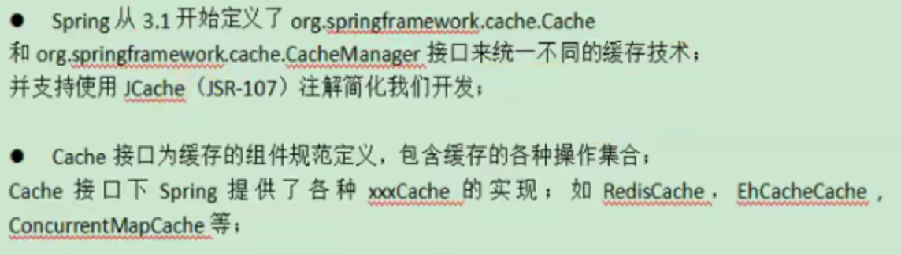
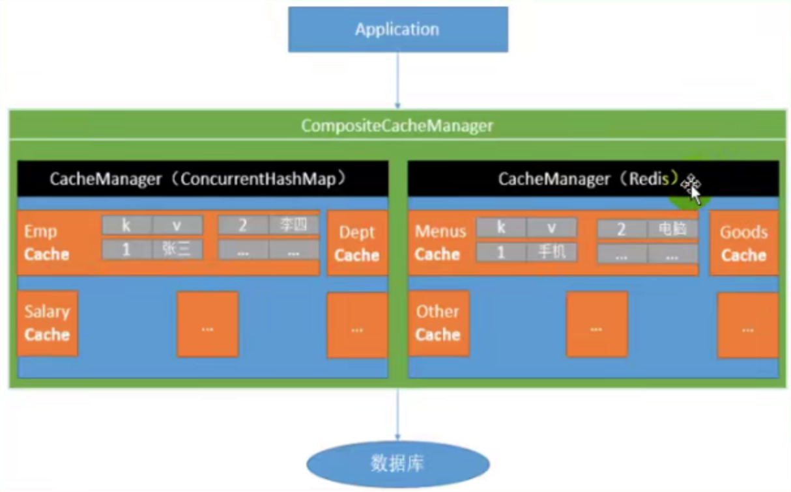

## SpringCache

### 简介



### 基础概念



### 整合&体验@Cacheable

#### 引入依赖

spring-boot-starter-cache, spring-boot-starter-data-redis

#### 写配置

##### 自动配置了哪些

CacheAutoConfiguration会导入RedisCacheConfiguration

自动配好了缓存管理器RedisCacheManager

##### 配置使用redis作为缓存

```properties
spring.cache.type=redis
```

#### 测试使用缓存

```properties
@Cacheable: Triggers cache population. 
	// 触发将数据保存到缓存的操作

@CacheEvict: Triggers cache eviction. 
	// 触发将数据从缓存删除的操作

@CachePut: Updates the cache without interfering with the method execution.
  // 不影响方法执行更新缓存

@Caching: Regroups multiple cache operations to be applied on a method.
  // 组合以上多个缓存

@CacheConfig: Shares some common cache-related settings at class-level.
  // 在类级别共享缓存的相同配置
```

##### 开启缓存功能

```properties
@EnableCaching
```

##### 只需要使用注解就能完成缓存操作

```properties
// 每一个需要缓存的数据我们都来指定要放到哪个名字的缓存。【缓存的分区（按照业务类型分）】
@Cacheable 
// 代表当前方法的结果需要缓存，如果缓存中有，方法不用调用。如果缓存中没有，会调用方法，最后将方法的结果放入缓存
```

##### 原理

```java
CacheAutoConfiguration -> RedisAutoConfiguration -> 自动配置了RedisCacheManager -> 初始化所有的缓存
-> 每个缓存决定使用什么配置 -> 如果redisCacheConfiguration有就用已有的，没有就用默认配置 
-> 想改缓存的配置，只需要给容器中放一个RedisCacheConfiguration即可
-> 就会应用到当前RedisCacheManager管理的所有缓存分区中
```

### @Cacheable细节设置

默认行为

1. 如果缓存中有，方法不用调用。
2. key默认自动生成：缓存的名字::SimpleKey[] (自动生成的key值)
3. 缓存的value的值，默认使用jdk序列化机制，将序列化后的数据存到redis
4. 默认ttl时间为-1；

自定义

1. 指定生成的缓存使用的key		key属性指定，接收一个SpEL表达式

   SpEL详细参考地址

   ```java
   https://docs.spring.io/spring-framework/docs/5.2.12.RELEASE/spring-framework-reference/integration.html#cache-spel-context
   ```

2. 指定缓存的数据的存活时间      配置文件中修改ttl: spring.cache.redis.time-to-live=3600000 毫秒

3. 将数据保存为json格式:

   CacheAutoConfiguration

   RedisAutoConfiguration

### 自定义缓存配置

MyCacheConfig.java

```java
package com.lzd.xmall.product.config;

import org.springframework.boot.autoconfigure.cache.CacheProperties;
import org.springframework.boot.context.properties.EnableConfigurationProperties;
import org.springframework.cache.annotation.EnableCaching;
import org.springframework.context.annotation.Bean;
import org.springframework.context.annotation.Configuration;
import org.springframework.data.redis.cache.RedisCacheConfiguration;
import org.springframework.data.redis.serializer.GenericJackson2JsonRedisSerializer;
import org.springframework.data.redis.serializer.RedisSerializationContext;
import org.springframework.data.redis.serializer.StringRedisSerializer;

@EnableConfigurationProperties(CacheProperties.class)
@Configuration
@EnableCaching
public class MyCacheConfig {

//    @Autowired
//    CacheProperties cacheProperties;

    /**
     * 配置文件中的东西没有生效
     *
     * 1、原来和配合文件绑定的配置类是这样的
     *      @ConfigurationProperties(prefix = "spring.cache")
     *      public class CacheProperties
     *
     * 2、要让它生效
     *      @EnableConfigurationProperties(CacheProperties.class)
     * @return
     */
    @Bean
    RedisCacheConfiguration redisCacheConfiguration(CacheProperties cacheProperties) {

        RedisCacheConfiguration config = RedisCacheConfiguration.defaultCacheConfig();

//        config = config.entryTtl();

        config = config.serializeKeysWith(RedisSerializationContext.SerializationPair.fromSerializer(new StringRedisSerializer()));
        config = config.serializeValuesWith(RedisSerializationContext.SerializationPair.fromSerializer(new GenericJackson2JsonRedisSerializer()));

        // 将配置文件中的所有配置都生效
        CacheProperties.Redis redisProperties = cacheProperties.getRedis();
        if (redisProperties.getTimeToLive() != null) {
            config = config.entryTtl(redisProperties.getTimeToLive());
        }
        if (redisProperties.getKeyPrefix() != null) {
            config = config.prefixCacheNameWith(redisProperties.getKeyPrefix());
        }
        if (!redisProperties.isCacheNullValues()) {
            config = config.disableCachingNullValues();
        }
        if (!redisProperties.isUseKeyPrefix()) {
            config = config.disableKeyPrefix();
        }


        return config;
    }
}
```

application.properties

```properties
spring.cache.type=redis

#spring.cache.cache-names=qq
spring.cache.redis.time-to-live=3600000
#如果指定了前缀就用我们指定的前缀，如果没有就默认使用缓存的名字作为前缀
spring.cache.redis.key-prefix=CACHE_
spring.cache.redis.use-key-prefix=true
#是否缓存空值，防止缓存穿透
spring.cache.redis.cache-null-values=true
```

### @CacheEvict

采用失效模式更新缓存，从缓存里面删除数据

1.同时进行多种缓存操作

```java
@Caching(evict = {
            @CacheEvict(value = {"category"}, key = "'getLevel1Categorys'"),
            @CacheEvict(value = {"category"}, key = "'getCatelogJson'")
    })
```

2.指定删除某个分区下的所有数据

```java
@CacheEvict(value = {"category"}, allEntries = true)
```

<font color="red">3.存储同一类型的数据，都可以指定成同一个分区，使用分区名作为前缀</font>

<font color="gree">application.properties</font>

```properties
spring.cache.type=redis

#spring.cache.cache-names=qq
spring.cache.redis.time-to-live=3600000
#如果指定了前缀就用我们指定的前缀，如果没有就默认使用缓存的名字作为前缀
#spring.cache.redis.key-prefix=CACHE_
spring.cache.redis.use-key-prefix=true
#是否缓存空值，防止缓存穿透
spring.cache.redis.cache-null-values=true
```

@CachePut

支持双写模式，将方法返回的结果放入缓存（<font color="red">方法需要有返回值</font>）。

### 原理与不足

1.读模式

缓存穿透

```properties
#是否缓存空值，防止缓存穿透
spring.cache.redis.cache-null-values=true
```

缓存击穿

默认是无加锁的，进行加锁解决击穿问题

```properties
@Cacheable(value = {"category"}, key = "#root.method.name", sync = true)
```

缓存雪崩

```properties
#加上过期时间
spring.cache.redis.time-to-live=3600000
```

2.写模式（缓存与数据库一致）

​	1）、读写加锁

​	2）、引入Canal，感知到MySQL的更新去更新数据库

​	3）、读多写多，直接去数据库查询

<font color="red">原理</font>

CacheManager(RedisCacheManager)->Cache(RedisCache)->Cache负责缓存的读写

<font color="red">总结</font>

常规数据（读多写少，即时性，一致性要求不高的数据）；完全可以使用SpringCache；写模式（只要缓存的数据有过期的时间就足够了）

特殊数据：特殊设置

