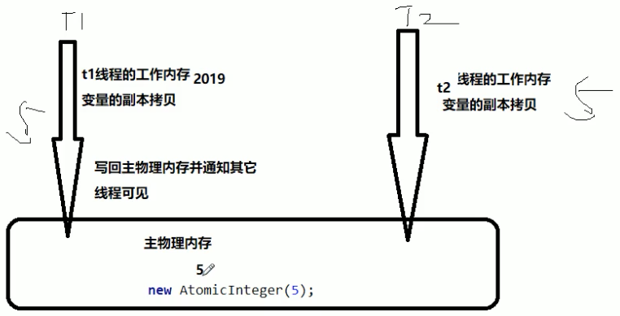
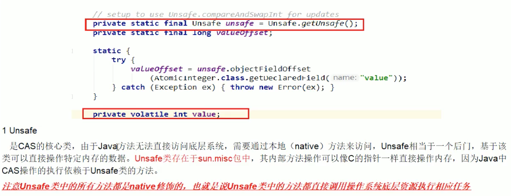
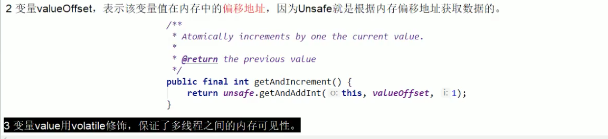
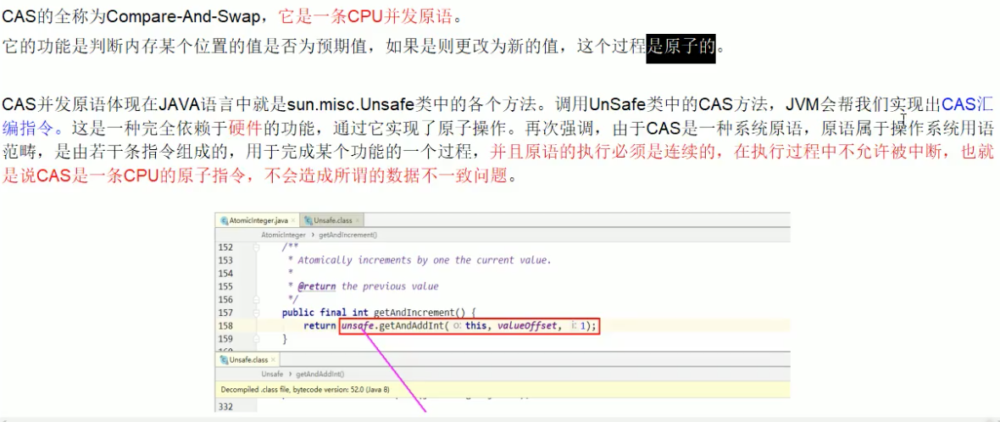
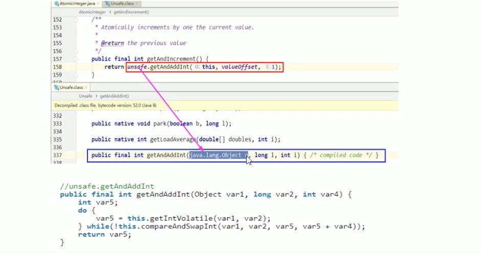
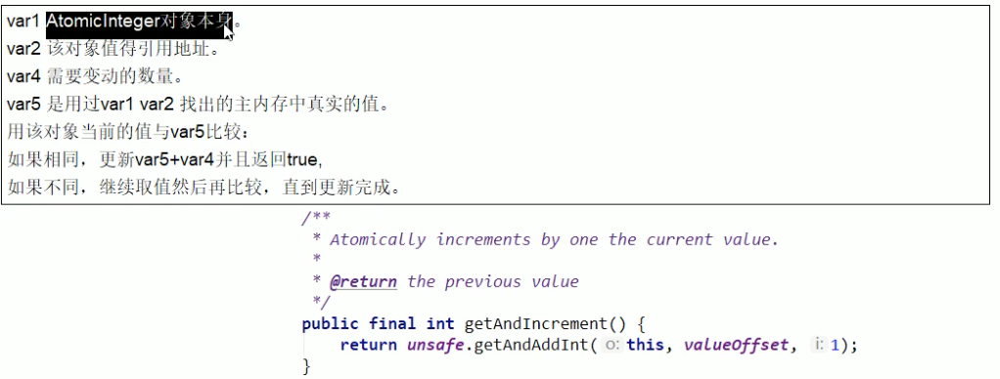
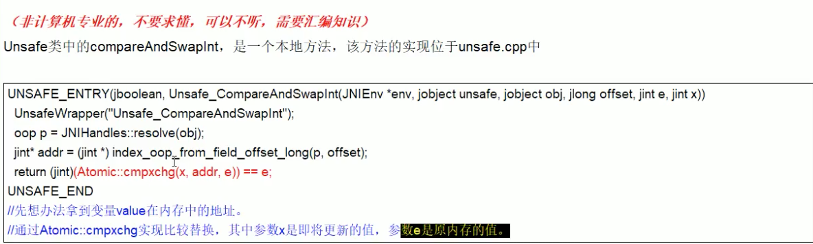
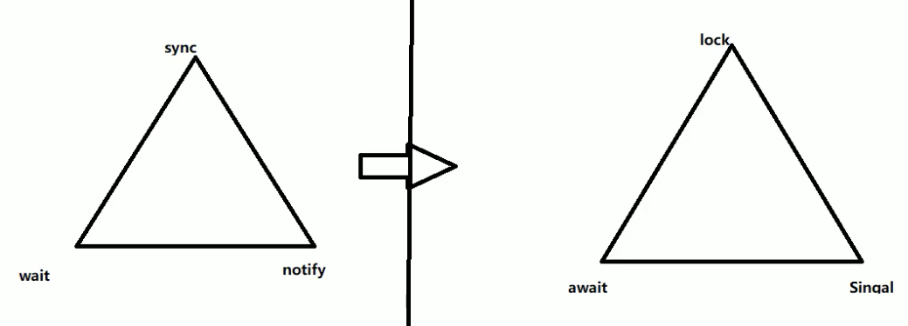
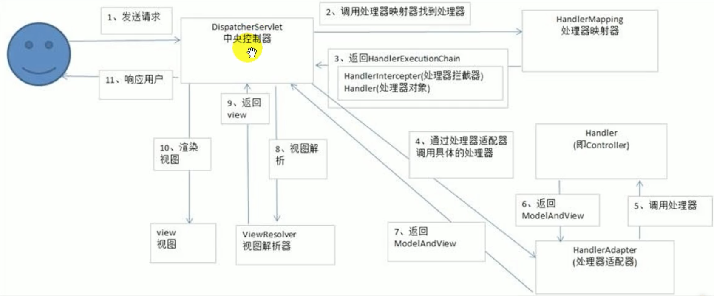

# 1. JAVA

## 1.1 字符串常量Java内部加载

```java
package com.lzd.interview;

public class StringPool58Demo { 

    public static void main(String[] args) {

        String s1 = new StringBuilder("58").append("tongcheng").toString();
        System.out.println(s1);
        System.out.println(s1.intern());
        System.out.println(s1 == s1.intern());

        System.out.println();

        String s2 = new StringBuilder("ja").append("va").toString();
        System.out.println(s2);
        System.out.println(s2.intern());
        System.out.println(s2 == s2.intern());
    }
}
/**
输出:
58tongcheng
58tongcheng
true

java
java
false
*/
```

讲解:

<font color="red">1、String::intern()方法是一个本地方法，它的作用是如果字符串常量池中已经包含了一个等于此String对象的字符串，则返回代表池中这个字符串的String对象的引用；否则，会将此String对象包含的字符串添加到常量池中，并且返回此String对象的引用。这段代码在JDK1.6中，会返回两个false，而在JDK1.7中运行，会得到一个true和一个false。</font>

<font color="red">2、产生差异的原因是，在JDK1.6中，intern()方法会把首次遇到的字符串实例复制到永久代的字符串常量池中存储，返回的也是永久代里面这个字符串实例的引用，而由StringBuilder创建的字符串对象实例在Java堆上，所以必然不可能是同一个引用，结果将返回false。</font>

<font color="red">3、在JDK1.7中（以及部分其他虚拟机，例如JRockit）的intern()方法实现就不需要再拷贝字符串的实例到永久代了，既然字符串常量池已经移到Java堆中，那只需要在常量池里记录一下首次出现的实例引用即可，因此intern()返回的引用和由StringBuilder创建的那个字符串实例就是同一个。</font>

<font color="red">4、而对s2比较返回false，这是因为java这个字符串在执行StringBuilder.toString()之前就已经出现过了，字符串常量池中已经有它的引用，不符合intern()要求“首次遇到”的原则，“58tongcheng”这个字符串则是首次出现的，因此结果返回true。</font>

<font color="red">5、参考java.lang.System类中initializeSystemClass()，调用sun.misc.Version.init()初始化一些版本信息。</font>

## 1.2 TwoSum

### 1.2.1 暴力破解法

```java
package com.lzd.interview;

public class TwoSum {

    private static int[] twoSum(int[] nums, int target) {
        for (int i = 0; i < nums.length; i++) {
            for (int j = i + 1; j < nums.length; j++) {
                if (nums[i] + nums[j] == target) {
                    return new int[]{i, j};
                }
            }
        }
        return null;
    }

    public static void main(String[] args) {
        int[] arr = twoSum(new int[]{2, 7, 11, 15}, 9);
        System.out.println(arr[0]);
        System.out.println(arr[1]);
    }
}
```

### 1.2.2 HashMap解法

```java
package com.lzd.interview;

import java.util.HashMap;
import java.util.Map;

public class TwoSum {

    private static int[] twoSum(int[] nums, int target) {

        Map<Integer, Integer> map = new HashMap<>();

        for (int i = 0; i < nums.length; i++) {
            int num = target - nums[i];
            if (map.containsKey(num)) {
                return new int[]{map.get(num), i};
            }

            map.put(nums[i], i);
        }
        return null;
    }

    public static void main(String[] args) {
        int[] arr = twoSum(new int[]{2, 7, 11, 15}, 22);
        System.out.println(arr[0]);
        System.out.println(arr[1]);
    }
}
```

## 1.3 CAS

AtomicInteger为什么要用CAS而不是用synchronized?

synchronized太重了，杀鸡焉用牛刀



```java
package com.lzd.interview;

import java.util.concurrent.atomic.AtomicInteger;

public class CasDemo {

    public static void main(String[] args) {

        AtomicInteger atomicInteger = new AtomicInteger(5);

        System.out.println(atomicInteger.compareAndSet(5, 2020) + "\t current data: " + atomicInteger.get());

        System.out.println(atomicInteger.compareAndSet(5, 2021) + "\t current data: " + atomicInteger.get());
    }
}

// 输出
true	 current data: 2020
false	 current data: 2020
```

底层原理是怎样的？

1.自旋锁

2.Unsafe类













## 1.4 JUC

### 1.4.1 线程通信

传统版



口诀：线程操作资源类，判断干活通知，防止虚假唤醒机制

while不能用if代替，会有虚假唤醒的可能，需要放到循环里

```java
package com.lzd.interview;

import java.util.concurrent.locks.Condition;
import java.util.concurrent.locks.Lock;
import java.util.concurrent.locks.ReentrantLock;

class ShareData { // 资源类

    private int number = 0;
    private Lock lock = new ReentrantLock();
    private Condition condition = lock.newCondition();

    public void increment() throws Exception {
        lock.lock();
        try {
            // 1. 判断
            while (number != 0) {
                // 等待 不能生产
                condition.await();
            }
            // 2. 干活
            number++;
            System.out.println(Thread.currentThread().getName() + "\t" + number);
            // 3. 通知唤醒
            condition.signalAll();
        } catch (Exception e) {
            e.printStackTrace();
        } finally {
            lock.unlock();
        }
    }

    public void decrement() throws Exception {
        lock.lock();
        try {
            // 1. 判断
            while (number == 0) {
                // 等待 不能生产
                condition.await();
            }
            // 2. 干活
            number--;
            System.out.println(Thread.currentThread().getName() + "\t" + number);
            // 3. 通知唤醒
            condition.signalAll();
        } catch (Exception e) {
            e.printStackTrace();
        } finally {
            lock.unlock();
        }
    }
}

/**
 * 题目：一个初始值为0的变量，两个线程对其交替操作，一个加1一个减1，来5轮
 * 1. 线程    操作（方法）   资源类
 * 2. 判断    干活          通知
 */
public class AwaitSignalDemo {

    public static void main(String[] args) {
        ShareData shareData = new ShareData();

        new Thread(() -> {
            for (int i = 0; i < 5; i++) {
                try {
                    shareData.increment();
                } catch (Exception e) {
                    e.printStackTrace();
                }
            }
        }, "AA").start();


        new Thread(() -> {
            for (int i = 0; i < 5; i++) {
                try {
                    shareData.decrement();
                } catch (Exception e) {
                    e.printStackTrace();
                }
            }
        }, "BB").start();
    }
}
```

### 1.4.2 synchronizd和Lock有什么区别，用Lock有什么好处

1）、synchronized是关键字属于JVM层面

​		 monitorenter（底层是通过monitor对象来完成，其实wait/notify等方法也依赖于monitor对象只有在同步块或方法中才能调用wait/notify等方法）

​		 monitorexit

Lock是具体类（java.util.concurrent.locks.Lock）是api层面的锁

2）、使用方法

​		synchronized不需要用户手动释放锁，当synchronized代码执行完后系统会自动让线程释放对锁的占用

​		ReentrantLock则需要用户手动释放锁若没有主动释放，就有可能导致死锁现象。

​		需要lock()和unlock()方法配合try/finally语句块来完成。

3）、等待是否可中断

​		synchronized不可中断，除非抛出异常或者正常运行完成

​		ReentrantLock可中断，1.设置超时方法 tryLock(long timeout, TimeUnit unit)

​											  2.lockInterruptibly()放代码块中，调用interrupt()方法可中断

4）、加锁是否公平

​		synchronized非公平锁

​		ReentrantLock两者都可以，默认非公平锁，构造方法可以传入boolean值，true为公平锁，false为非公平锁

5）、锁绑定多个条件Condition

​		synchronized没有

​		ReentrantLock用来实现分组唤醒需要唤醒的线程们，可以精确唤醒，而不是项synchronized需要随机唤醒一个线程要么唤醒全部线程。

```java
package com.lzd.interview;

import java.util.concurrent.locks.Condition;
import java.util.concurrent.locks.Lock;
import java.util.concurrent.locks.ReentrantLock;

/**
 * synchronized和lock区别
 * <p===lock可绑定多个条件===
 * 对线程之间按顺序调用，实现A>B>C三个线程启动，要求如下：
 * AA打印5次，BB打印10次，CC打印15次
 * 紧接着
 * AA打印5次，BB打印10次，CC打印15次
 * 。。。。
 * 来十轮
 */
public class SyncAndReentrantLockDemo {
    public static void main(String[] args) {
        ShareData2 shareData = new ShareData2();
        new Thread(() -> {
            for (int i = 1; i <= 10; i++) {
                shareData.print5();
            }
        }, "A").start();
        new Thread(() -> {
            for (int i = 1; i <= 10; i++) {
                shareData.print10();
            }
        }, "B").start();
        new Thread(() -> {
            for (int i = 1; i <= 10; i++) {
                shareData.print15();
            }
        }, "C").start();
    }

}

class ShareData2 {
    private int number = 1;//A:1 B:2 C:3
    private Lock lock = new ReentrantLock();
    private Condition condition1 = lock.newCondition();
    private Condition condition2 = lock.newCondition();
    private Condition condition3 = lock.newCondition();

    public void print5() {
        lock.lock();
        try {
            //判断
            while (number != 1) {
                condition1.await();
            }
            //干活
            for (int i = 1; i <= 5; i++) {
                System.out.println(Thread.currentThread().getName() + "\t" + i);
            }
            //通知
            number = 2;
            condition2.signal();

        } catch (Exception e) {
            e.printStackTrace();
        } finally {
            lock.unlock();
        }
    }

    public void print10() {
        lock.lock();
        try {
            //判断
            while (number != 2) {
                condition2.await();
            }
            //干活
            for (int i = 1; i <= 10; i++) {
                System.out.println(Thread.currentThread().getName() + "\t" + i);
            }
            //通知
            number = 3;
            condition3.signal();

        } catch (Exception e) {
            e.printStackTrace();
        } finally {
            lock.unlock();
        }
    }

    public void print15() {
        lock.lock();
        try {
            //判断
            while (number != 3) {
                condition3.await();
            }
            //干活
            for (int i = 1; i <= 15; i++) {
                System.out.println(Thread.currentThread().getName() + "\t" + i);
            }
            //通知
            number = 1;
            condition1.signal();

        } catch (Exception e) {
            e.printStackTrace();
        } finally {
            lock.unlock();
        }
    }
}
```

### 1.4.3 线程通信3.0版

```java
package com.lzd.interview;

import java.util.concurrent.ArrayBlockingQueue;
import java.util.concurrent.BlockingQueue;
import java.util.concurrent.TimeUnit;
import java.util.concurrent.atomic.AtomicInteger;

public class ProdConsumer_BlockQueueDemo {

    public static void main(String[] args) {
        MyResource myResource = new MyResource(new ArrayBlockingQueue<>(10));
        new Thread(() -> {
            System.out.println(Thread.currentThread().getName() + "\t生产线程启动");
            try {
                myResource.myProd();
            } catch (Exception e) {
                e.printStackTrace();
            }
        }, "Prod").start();
        new Thread(() -> {
            System.out.println(Thread.currentThread().getName() + "\t消费线程启动");
            try {
                myResource.myConsumer();
            } catch (Exception e) {
                e.printStackTrace();
            }
        }, "Consumer").start();

        try {
            TimeUnit.SECONDS.sleep(5);
        } catch (InterruptedException e) {
            e.printStackTrace();
        }
        System.out.println("5s后main叫停，线程结束");
        try {
            myResource.stop();
        } catch (Exception e) {
            e.printStackTrace();
        }
    }
}

class MyResource {
    private volatile boolean flag = true;//默认开启，进行生产+消费
    private AtomicInteger atomicInteger = new AtomicInteger();

    BlockingQueue<String> blockingQueue = null;

    public MyResource(BlockingQueue<String> blockingQueue) {
        this.blockingQueue = blockingQueue;
        System.out.println(blockingQueue.getClass().getName());
    }

    public void myProd() throws Exception {
        String data = null;
        boolean retValue;
        while (flag) {
            data = atomicInteger.incrementAndGet() + "";
            retValue = blockingQueue.offer(data, 2, TimeUnit.SECONDS);
            if (retValue) {
                System.out.println(Thread.currentThread().getName() + "\t插入队列" + data + "成功");
            } else {
                System.out.println(Thread.currentThread().getName() + "\t插入队列" + data + "失败");
            }
            TimeUnit.SECONDS.sleep(1);
        }
        System.out.println(Thread.currentThread().getName() + "\t大老板叫停了，flag=false，生产结束");
    }

    public void myConsumer() throws Exception {
        String result = null;
        while (flag) {
            result = blockingQueue.poll(2, TimeUnit.SECONDS);
            if (null == result || result.equalsIgnoreCase("")) {
                flag = false;
                System.out.println(Thread.currentThread().getName() + "\t超过2s没有取到蛋糕，消费退出");
                System.out.println();
                return;
            }
            System.out.println(Thread.currentThread().getName() + "\t消费队列" + result + "成功");
        }
    }

    public void stop() throws Exception {
        flag = false;
    }
}
```

### 1.4.4 AQS

锁升级顺序：偏向锁（jdk1.6之后）->轻量级锁->自旋锁（10次）->重量级锁（悲观锁）

Synchronized使用场景：在超高并发，且锁定的时间比较长，最合适。wait()阻塞，不消耗cpu资源

CAS使用场景：锁竞争不激烈。for(;;)消耗cpu资源

## 1.5 Java基础

### 1.5.1 ==和equals比较

==对比的是栈中的值，基本数据类型是变量值，引用类型是堆中内存对象的地址

equals: object中默认也是采用==比较，通常会重写

### 1.5.2 final

修饰类：表示不可被继承

修饰方法：表示方法不可被子类覆盖，但是可以重载

修饰变量：表示变量一旦被赋值就不可以更改它的值

（1）修饰成员变量

*如果final修饰的是类变量（static变量），只能在静态初始化代码块中指定初始值或者声明该变量时指定初始值

*如果final修饰的是成员变量，可以在非静态初始化代码块、声明该变量或者构造器中执行初始值

（2）修饰局部变量

系统不会为局部变量进行初始化，局部变量必须由程序员显示初始化。因此使用final修饰局部变量时，即可以在定义时指定默认值（后面的代码不能对变量再赋值），也可以不指定默认值，而在后面的代码中对final变量赋初始值（仅一次）

```java
public class FinalVal {
  final static int a = 0; // 再声明的时候就需要赋值 或者静态代码块赋值
  /**
  	static {
  		a = 0;
  	}
  */
  final int b = 0; // 再声明的时候就需要赋值 或者代码块中赋值  或者构造器赋值
  /*
  	{
  		b = 0;
  	}
  */
  public static void main(String[] args) {
    final int localA;	// 局部变量只声明没有初始化，不会报错，与final无关
    localA = 0;	// 	在使用之前一定要赋值
    // localA = 1;	但是不允许第二次赋值
  }
}
```

（3）修饰基本类型数据和引用类型数据

*如果是基本数据类型的变量，则与数值一旦在初始化之后便不能更改；

*如果是引用类型的变量，则在对其初始化之后便不能再让其指向另一个对象。<font color=red>但是引用的值是可变的。</font>

```java
public class FinalReferenceTest {
  public static void main(String[] args) {
    final int[] iArr = {1, 2, 3, 4};
    iArr[2] = -3; // 合法
    iArr = null; // 非法，对iArr不能重新赋值
    
    final Person p = new Person(25)；
    p.setAge(24); // 合法
    p = null; // 非法
  }
}
```

为什么局部内部类和匿名内部类只能访问局部final变量？

编译之后会生成两个class文件，Test.class Test1.class

```java
public class Test {
  public static void main(String[] args) {
    
  }
  // 局部final变量a, b
  public void test(final int b) {
    final int a = 10;
    // 匿名内部类
    new Thread() {
      public void run() {
        System.out.println(a);
        System.out.println(b);
      }
    }.start();
  }
}

class OutClass {
  private int age = 12;
  
  public void outPrint(final int x) {
    	class InClass {
        	public void InPrint() {
            	System.out.println(x);
            	System.out.println(age);
          }
      }
    	new InClass.InPrint();
  }
}
```

首先要知道的一点是：内部类和外部类是处于同一个级别的，内部类不会因为定义在方法中就会随着方法的执行完毕就被销毁。

这里就会产生问题：当外部类的方法结束时，局部变量就会被销毁了，但是内部类对象可能还存在（只有没有人再引用它时，才会死亡）。这里就出现了一个矛盾：内部类对象访问了一个不存在的变量。为了解决这个问题，就将局部变量复制了一份作为内部类的成员变量，这样当局部变量死亡后，内部类仍可以访问它，实际访问的是局部变量的"copy"。这样就好像延长了局部变量的生命周期

将局部变量复制为内部类的成员变量时，必须保证两个变量是一样的，也就是如果我们在内部类中修改了成员变量，方法中的局部变量也得跟着改变，怎么解决问题呢？

就将局部变量设置为final，对它初始化后，我就不让你再去修改这个变量，就保证了内部类的成员变量和方法的局部变量的一致性。这实质上也是一种妥协。使得局部变量与内部类建立的拷贝保持一致。

## 1.6 尚硅谷面试题第一季

### 1.6.1 单例设计模式

### 1.6.2 类初始化和实例初始化等

```java
package com.atguigu.test;

/*
 * 父类的初始化<clinit>：
 * （1）j = method();
 * （2）父类的静态代码块
 * 
 *  父类的实例化方法：
 * （1）super()（最前）
 * （2）i = test();
 * （3）父类的非静态代码块
 * （4）父类的无参构造（最后）
 * 
 * 非静态方法前面其实有一个默认的对象this
 * this在构造器（或<init>）它表示的是正在创建的对象，因为这里是在创建Son对象，所以
 * test()执行的是子类重写的代码（面向对象多态）
 * 
 * 这里i=test()执行的是子类重写的test()方法
 */
public class Father{
	private int i = test();
	private static int j = method();
	
	static{
		System.out.print("(1)");
	}
	Father(){
		System.out.print("(2)");
	}
	{
		System.out.print("(3)");
	}
	
	
	public int test(){
		System.out.print("(4)");
		return 1;
	}
	public static int method(){
		System.out.print("(5)");
		return 1;
	}
}
```

```java
package com.atguigu.test;

/*
 * 子类的初始化<clinit>：
 * （1）j = method();
 * （2）子类的静态代码块
 * 
 * 先初始化父类：(5)(1)
 * 初始化子类：（10）(6)
 * 
 * 子类的实例化方法<init>：
 * （1）super()（最前）      （9）（3）（2）
 * （2）i = test();    （9）
 * （3）子类的非静态代码块    （8）
 * （4）子类的无参构造（最后） （7）
 * 
 * 因为创建了两个Son对象，因此实例化方法<init>执行两次
 * 
 * （9）（3）（2）（9）（8）（7）
 */
public class Son extends Father{
	private int i = test();
	private static int j = method();
	static{
		System.out.print("(6)");
	}
	Son(){
//		super();//写或不写都在，在子类构造器中一定会调用父类的构造器
		System.out.print("(7)");
	}
	{
		System.out.print("(8)");
	}
	public int test(){
		System.out.print("(9)");
		return 1;
	}
	public static int method(){
		System.out.print("(10)");
		return 1;
	}
	public static void main(String[] args) {
		Son s1 = new Son();
		System.out.println();
		Son s2 = new Son();
	}
}
```

### 1.6.3 递归与迭代

```java
package com.lzd.interview.递归与迭代;

public class Test {
    
    public static void main(String[] args) {
        System.out.println(loop(4));
    }

    public static int loop(int n) {
        if (n == 1 || n == 2) {
            return 1;
        }
        int a = 1, b = 1, sum = 0;
        for (int i = 3; i <= n; i++) {
            sum = a + b;
            a = b;
            b = sum;
        }
        return sum;
    }
}
```

### 1.6.4 成员变量与局部变量

<font color=red>非静态代码块每创建1个对象就会执行1次</font>

```java
package com.lzd.interview.成员变量与局部变量;

public class Exam5 {
    static int s;//成员变量，类变量
    int i;//成员变量，实例变量
    int j;//成员变量，实例变量

    {
        int i = 1;//非静态代码块中的局部变量 i
        i++;
        j++;
        s++;
    }

    public void test(int j) {//形参，局部变量,j
        j++;
        i++;
        s++;
    }

    public static void main(String[] args) {//形参，局部变量，args
        Exam5 obj1 = new Exam5();//局部变量，obj1
        Exam5 obj2 = new Exam5();//局部变量，obj1
        obj1.test(10);
        obj1.test(20);
        obj2.test(30);
        System.out.println(obj1.i + "," + obj1.j + "," + obj1.s);
        System.out.println(obj2.i + "," + obj2.j + "," + obj2.s);
    }
}
```

### 1.6.5 Spring支持的常用数据库事务传播属性事务隔离级别

#### 事务的属性

1. propagation：用来设置事务的传播行为

事务的传播行为：一个方法运行在了一个开启了事务的方法中时，当前方法是使用原来的事务还是开启一个新的事务。

-Propagation.REQUIRED: 默认值，使用原来的事务。

-Propagation.REQUIRES_NEW: 将原来的事务挂起，开启一个新的事务。

2. isolation: 设置事务的隔离级别

   Isolation.READ_COMMITTED: 读已提交，Oracle默认的隔离级别，开发时通常使用的隔离级别

   Isolation.REPEATABLE_READ: 可重复读，MySQL默认的隔离级别

### 1.6.6 SpringMVC如何解决POST和GET请求乱码问题

1.POST: CharacterEncodingFilter过滤器

2.GET：在tomcat中server.xml里第一个Connector标签添加URIEncoding="UTF-8"

### 1.6.7 简单地谈一谈SpringMVC的工作流程



### 1.6.8 ES和Solr的区别

1.当实时建立索引的时候，solr会产生io阻塞，而es不会，es查询性能要高于solr。

2.在不断动态添加数据的时候，solr的检索效率会变得低下，而es则没有什么变化。

3.solr利用zookeeper进行分布式管理，而es自身带有分布式系统管理功能。Solr一般都要部署到web服务器，比如tomcat。启动tomcat的时候需要配置tomcat与solr的关联。【solr的本质是一个动态的web项目】

4.Solr支持更多的数据格式[xml,json,csv]，而es仅支持json文件格式。

## 1.7 尚硅谷面试题第二季

### 1.7.1 volatile

#### 1.7.2 可见性的代码说明

```java
package com.lzd.interview;

import java.util.concurrent.TimeUnit;

class MyData {

    volatile int number = 0;

    public void addTo60() {
        this.number = 60;
    }
}

public class VolatileDemo {

    public static void main(String[] args) {

        MyData myData = new MyData();

        new Thread(()->{
            System.out.println(Thread.currentThread().getName() + "\t come in");
            try {
                TimeUnit.SECONDS.sleep(3);
            } catch (InterruptedException e) {
                e.printStackTrace();
            }
            myData.addTo60();
            System.out.println(Thread.currentThread().getName() + "\t update number value: " + myData.number);
        }, "AAA").start();


//        try {
//            TimeUnit.SECONDS.sleep(6);
//        } catch (InterruptedException e) {
//            e.printStackTrace();
//        }

//        System.out.println(myData.number);
        while (myData.number == 0) {

        }

        System.out.println(Thread.currentThread().getName() + "\t mission is over");
    }
}
```

#### 1.7.3 不保证原子性

```java
package com.lzd.interview.volatilee.atomic;


class MyData {

    volatile int number = 0;

    public void addPlusPlus() {
        number++;
    }
}

public class Demo {

    public static void main(String[] args) {

        MyData myData = new MyData();

        for (int i = 0; i < 20; i++) {

            new Thread(() -> {
                for (int j = 0; j < 1000; j++) {
                    myData.addPlusPlus();
                }
            }, String.valueOf(i)).start();
        }

        while (Thread.activeCount() > 2) {
            Thread.yield();
        }

        System.out.println(Thread.currentThread().getName() + "\t finally number value: " + myData.number);
    }
}
```

#### 1.7.4 解决volatile不保证原子性问题

```java
package com.lzd.interview.volatilee.atomic;


import java.util.concurrent.atomic.AtomicInteger;

class MyData {

    volatile int number = 0;

    public void addPlusPlus() {
        number++;
    }

    AtomicInteger atomicInteger = new AtomicInteger();

    public void addMyAtomic() {
        atomicInteger.getAndIncrement();
    }
}

public class Demo {

    public static void main(String[] args) {

        MyData myData = new MyData();

        for (int i = 0; i < 20; i++) {

            new Thread(() -> {
                for (int j = 0; j < 1000; j++) {
                    myData.addPlusPlus();
                    myData.addMyAtomic();
                }
            }, String.valueOf(i)).start();
        }

        while (Thread.activeCount() > 2) {
            Thread.yield();
        }

        System.out.println(Thread.currentThread().getName() + "\t finally number value: " + myData.number);
        System.out.println(Thread.currentThread().getName() + "\t finally number value: " + myData.atomicInteger);
    }
}
```

#### 1.7.5 单例模式下volatile分析

```java
package com.lzd.interview.volatilee.singleton;

public class SingletonDemo {

    private static volatile SingletonDemo instance = null;

    private SingletonDemo() {
        System.out.println(Thread.currentThread().getName() + "\t 我是构造方法SingletonDemo()");
    }

    public static SingletonDemo getInstance() {

        if (instance == null) {

            synchronized (SingletonDemo.class) {

                if (instance == null) {

                    instance = new SingletonDemo();
                }
            }
        }
        return instance;
    }

    public static void main(String[] args) {

        for (int i = 0; i < 100; i++) {
            new Thread(SingletonDemo::getInstance, String.valueOf(i)).start();
        }
    }
}
```

### 1.7.2 AtomicReference原子引用

```java
package com.lzd.interview.atomicreference;

import java.util.concurrent.atomic.AtomicReference;

class User {

    private String userName;
    private int age;

    public User() {
    }

    public User(String userName, int age) {
        this.userName = userName;
        this.age = age;
    }

    public String getUserName() {
        return userName;
    }

    public void setUserName(String userName) {
        this.userName = userName;
    }

    public int getAge() {
        return age;
    }

    public void setAge(int age) {
        this.age = age;
    }

    @Override
    public String toString() {
        return "User{" +
                "userName='" + userName + '\'' +
                ", age=" + age +
                '}';
    }
}

public class AtomicReferenceDemo {

    public static void main(String[] args) {

        User z3 = new User("z3", 22);
        User li4 = new User("li4", 25);

        AtomicReference<User> atomicReference = new AtomicReference<>();
        atomicReference.set(z3);

        System.out.println(atomicReference.compareAndSet(z3, li4) + "\t " + atomicReference.get().toString());
        System.out.println(atomicReference.compareAndSet(z3, li4) + "\t " + atomicReference.get().toString());
    }
}
```

### 1.7.3 ABA问题解决

```java
package com.lzd.interview.atomicreference;

import java.util.concurrent.TimeUnit;
import java.util.concurrent.atomic.AtomicReference;
import java.util.concurrent.atomic.AtomicStampedReference;

public class ABADemo {

    static AtomicReference<Integer> atomicReference = new AtomicReference<>(100);
    static AtomicStampedReference<Integer> atomicStampedReference = new AtomicStampedReference<>(100, 1);

    public static void main(String[] args) {

        System.out.println("以下是ABA问题的产生");

        new Thread(() -> {
            atomicReference.compareAndSet(100, 101);
            atomicReference.compareAndSet(101, 100);
        }, "t1").start();

        new Thread(() -> {
            try {
                TimeUnit.SECONDS.sleep(1);
            } catch (InterruptedException e) {
                e.printStackTrace();
            }
            System.out.println(atomicReference.compareAndSet(100, 2019) + "\t" + atomicReference.get());
        }, "t2").start();

        try {
            TimeUnit.SECONDS.sleep(2);
        } catch (InterruptedException e) {
            e.printStackTrace();
        }
        System.out.println("以下是ABA问题的解决");

        new Thread(() -> {
            int stamp = atomicStampedReference.getStamp();
            System.out.println(Thread.currentThread().getName() + "\t 第一次版本号: " + stamp);

            try {
                TimeUnit.SECONDS.sleep(1);
            } catch (InterruptedException e) {
                e.printStackTrace();
            }

            atomicStampedReference.compareAndSet(100, 101, atomicStampedReference.getStamp(), atomicStampedReference.getStamp() + 1);
            System.out.println(Thread.currentThread().getName() + "\t 第二次版本号: " + atomicStampedReference.getStamp());

            atomicStampedReference.compareAndSet(101, 100, atomicStampedReference.getStamp(), atomicStampedReference.getStamp() + 1);
            System.out.println(Thread.currentThread().getName() + "\t 第三次版本号: " + atomicStampedReference.getStamp());

        }, "t3").start();


        new Thread(() -> {
            int stamp = atomicStampedReference.getStamp();
            System.out.println(Thread.currentThread().getName() + "\t 第一次版本号: " + stamp);

            try {
                TimeUnit.SECONDS.sleep(3);
            } catch (InterruptedException e) {
                e.printStackTrace();
            }

            boolean result = atomicStampedReference.compareAndSet(100, 2019, stamp, stamp + 1);
            System.out.println(Thread.currentThread().getName() + "\t 修改成功否: " + result + "\t 当前最新实际版本号: " + atomicStampedReference.getStamp());

            System.out.println(Thread.currentThread().getName() + "\t 当前实际最新值: " + atomicStampedReference.getReference());
        }, "t4").start();
    }
}
```

### 1.7.4 自旋锁

```java
package com.lzd.interview.自旋锁;

import java.util.concurrent.TimeUnit;
import java.util.concurrent.atomic.AtomicReference;

public class SpinLockDemo {

    // 原子引用线程
    AtomicReference<Thread> atomicReference = new AtomicReference<>();

    public void myLock() {
        Thread thread = Thread.currentThread();
        System.out.println(Thread.currentThread().getName() + "\t come in");

        while (!atomicReference.compareAndSet(null, thread)) {

        }
    }

    public void myUnlock() {
        Thread thread = Thread.currentThread();
        atomicReference.compareAndSet(thread, null);
        System.out.println(Thread.currentThread().getName() + "\t invoke myUnlock");
    }

    public static void main(String[] args) {

        SpinLockDemo spinLockDemo = new SpinLockDemo();

        new Thread(() -> {
            spinLockDemo.myLock();

            try {
                TimeUnit.SECONDS.sleep(5);
            } catch (InterruptedException e) {
                e.printStackTrace();
            }

            spinLockDemo.myUnlock();
        }, "AA").start();

        try {
            TimeUnit.SECONDS.sleep(1);
        } catch (InterruptedException e) {
            e.printStackTrace();
        }

        new Thread(() -> {
            spinLockDemo.myLock();
            spinLockDemo.myUnlock();
        }, "BB").start();
    }
}
```

### 1.7.5 读写锁

```java
package com.lzd.interview.读写锁;


import java.util.HashMap;
import java.util.Map;
import java.util.concurrent.TimeUnit;
import java.util.concurrent.locks.ReentrantReadWriteLock;

class MyCache {

    private volatile Map<String, Object> map = new HashMap<>();
    private ReentrantReadWriteLock lock = new ReentrantReadWriteLock();

    public void put(String key, Object value) {
        lock.writeLock().lock();

        try {
            System.out.println(Thread.currentThread().getName() + "\t 正在写入: " + key);

            try {
                TimeUnit.MILLISECONDS.sleep(300);
            } catch (InterruptedException e) {
                e.printStackTrace();
            }

            map.put(key, value);

            System.out.println(Thread.currentThread().getName() + "\t 写入完成: " + key);
        } catch (Exception e) {
            e.printStackTrace();
        } finally {
            lock.writeLock().unlock();
        }
    }

    public void get(String key) {

        lock.readLock().lock(); // 如果读不加锁也可以 加了锁 就保证了一定得写完了才能读
        try {
            System.out.println(Thread.currentThread().getName() + "\t 正在读取: ");

            try {
                TimeUnit.MILLISECONDS.sleep(300);
            } catch (InterruptedException e) {
                e.printStackTrace();
            }

            Object result = map.get(key);

            System.out.println(Thread.currentThread().getName() + "\t 读取完成: " + result);
        } catch (Exception e) {
            e.printStackTrace();
        } finally {
            lock.readLock().unlock();
        }
    }
}

public class ReadWriteLockDemo {

    public static void main(String[] args) {

        MyCache myCache = new MyCache();

        for (int i = 0; i < 5; i++) {
            final int tempInt = i;
            new Thread(() -> myCache.put(tempInt + "", tempInt), String.valueOf(i)).start();
        }

        for (int i = 0; i < 5; i++) {
            final int tempInt = i;
            new Thread(() -> myCache.get(tempInt + ""), String.valueOf(i)).start();
        }
    }
}
```


