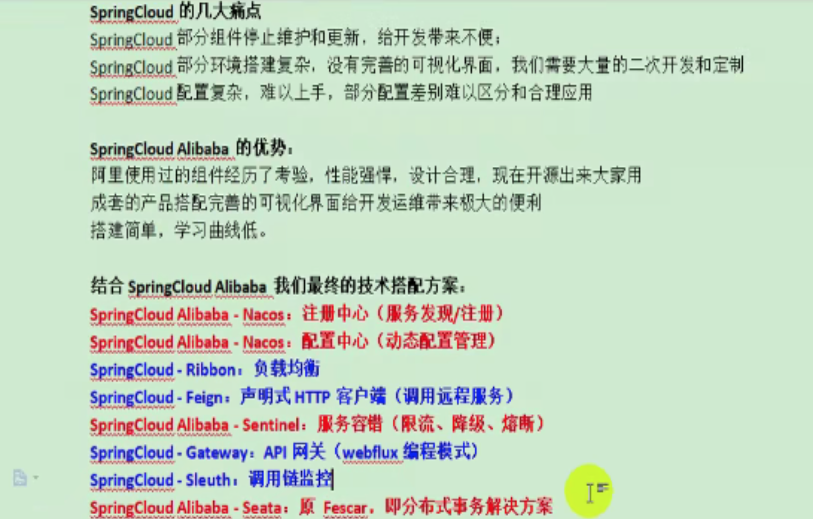
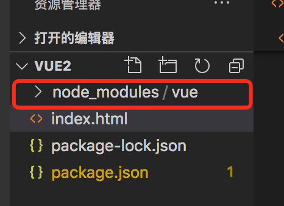
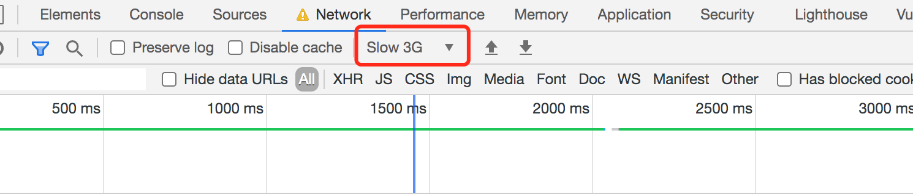

# 1. SpringCloud Alibaba

## 1.1 SpringCloud Alibaba介绍



版本适配


## 1.2 SpringCloud Alibaba-Nacos作为注册中心

github地址

```java
https://github.com/alibaba/spring-cloud-alibaba/blob/master/README-zh.md
```

Linux/Unix/Mac操作系统，执行命令启动nacos

```shell
sh startup.sh -m standalone
```

nacos访问地址

```java
http://127.0.0.1:8848/nacos/#/login
```

## 1.6 SpringCloud Alibaba-OSS


# 4. Vue

## 4.1 MVVM思想

M: 即Model，模型，包括一些数据和一些基本操作

V: 即View，视图，页面渲染结果

VM: 即View-Model，模型与视图间的双向操作（无需开发人员干涉）

在MVVM之前，开发人员从后端获取需要的数据模型，然后通过DOM操作Model，渲染到View中。而后当用户操作视图，我们还需要通过View中的数据，然后同步到Model中。

而MVVM中的VM要做的事情是把DOM操作完全封装起来，开发人员不需要关心Model和View之间如何互相影响。

## 4.2 Vue介绍及使用

1.使用 npm init -y 初始化项目，初始化后会生成package.json文件，表示由npm来管理的项目。

2.使用 npm install vue 来安装vue相关包，会生成node_modules/vue目录。



3.Vue版HelloWorld

```vue
<!DOCTYPE html>
<html lang="en">
<head>
    <meta charset="UTF-8">
    <meta name="viewport" content="width=device-width, initial-scale=1.0">
    <title>Document</title>
</head>
<body>
    <div id="app">
        <input type="text" v-model="num" />
        <h1>{{name}},非常帅,有{{num}}个人点赞</h1>
    </div>

    <script src="./node_modules/vue/dist/vue.js"></script>
    
    <script>
        let vm = new Vue({ // 创建一个vue对象
            el: "#app", // el全称element
            data: {
                name: "张三",
                num: 1
            }
        });
        
    </script>
</body>
</html>
```

## 4.3 Vue基本语法和插件安装

vscode可以安装vetur和vue 3 snippets插件，方便提示代码。

chrome可以安装vue devtool插件。

```vue
<!DOCTYPE html>
<html lang="en">
<head>
    <meta charset="UTF-8">
    <meta name="viewport" content="width=device-width, initial-scale=1.0">
    <title>Document</title>
</head>
<body>
    <div id="app">
        <input type="text" v-model="num" />
        <button v-on:click="num++">点赞</button>
        <button v-on:click="cancel">取消</button>
        <h1>{{name}},非常帅,有{{num}}个人点赞</h1>
    </div>

    <script src="./node_modules/vue/dist/vue.js"></script>
    
    <script>
        // 1.vue声明式渲染
        let vm = new Vue({ // 创建一个vue对象
            el: "#app", // el全称element
            data: { // 绑定数据
                name: "张三",
                num: 1
            },
            methods: { // 封装方法
                cancel(){
                    this.num--;
                }
            },
        });
        // 2.双向绑定，模型变化，视图变化。反之亦然。

        // 3.事件处理

        // 4.v-xx 指令

        // 1、创建Vue实例，关联页面的模板，将自己的数据（data）渲染到关联的模板，响应式的
        // 2、指令来简化对DOM的一些操作
        // 3、声明方法来做更简单的操作。methods里面可以封装方法
    </script>
</body>
</html>
```

## 4.4 Vue指令-单向绑定&双向绑定

浏览器可以模拟网速慢的效果，开3G



### 4.4.1 v-text、v-html

```vue
<!DOCTYPE html>
<html lang="en">
<head>
    <meta charset="UTF-8">
    <meta name="viewport" content="width=device-width, initial-scale=1.0">
    <title>Document</title>
</head>
<body>
    <div id="app">
        {{msg}} {{1+1}} {{hello()}}<br/> <!--网速慢情况下存在插值闪烁问题-->
        <span v-html="msg"></span>
        <br/>
        <span v-text="msg"></span>
    </div>

    <script src="../node_modules/vue/dist/vue.js"></script>

    <script>
        new Vue({
            el:"#app",
            data:{
                msg:"<h1>Hello</h1>"
            },
            methods: {
                hello(){
                    return "World"
                }
            },
        })
    </script>
</body>
</html>
```

### 4.4.2 v-bind

```vue
<!DOCTYPE html>
<html lang="en">
<head>
    <meta charset="UTF-8">
    <meta name="viewport" content="width=device-width, initial-scale=1.0">
    <title>Document</title>
</head>
<body>
    <div id="app">
        <a v-bind:href="link">gogogo</a>

        <!-- class,style {class名: 加上?}-->
        <span v-bind:class="{active:isActive, 'text-danger':hasError}"
        :style="{color: color1, fontSize: size}">你好</span>
    </div>

    <script src="../node_modules/vue/dist/vue.js"></script>

    <script>
        let vm = new Vue({
            el:"#app",
            data:{
                link: "http://www.baidu.com",
                isActive: true,
                hasError: true,
                color1: 'red',
                size: '36px'
            }
        })
    </script>
</body>
</html>
```

### 4.4.3 v-model

```vue
<!DOCTYPE html>
<html lang="en">
<head>
    <meta charset="UTF-8">
    <meta name="viewport" content="width=device-width, initial-scale=1.0">
    <title>Document</title>
</head>
<body>

    <!-- 表单项，自定义组件 -->
    <div id="app">
        精通的语言：
            <input type="checkbox" v-model="language" value="Java"/>Java<br/>
            <input type="checkbox" v-model="language" value="C++"/>C++<br/>
            <input type="checkbox" v-model="language" value="Python"/>Python<br/>
        选中了{{language.join(",")}}
    </div>

    <script src="../node_modules/vue/dist/vue.js"></script>

    <script>
        let vm = new Vue({
            el: "#app",
            data: {
                language: []
            }
        })
    </script>
</body>
</html>
```

### 4.4.4 v-on

```vue
<!DOCTYPE html>
<html lang="en">
<head>
    <meta charset="UTF-8">
    <meta name="viewport" content="width=device-width, initial-scale=1.0">
    <title>Document</title>
</head>
<body>
    <div id="app">

        <!--事件中直接写js片段-->
        <button v-on:click="num++">点赞</button>
        <!--事件指定一个回调函数，必须是Vue实例中定义的函数-->
        <button @click="cancel()">取消</button>
        <!---->
        <h1>有{{num}}个赞</h1>

        <!-- 事件修饰符 -->
        <div style="border: 1px solid red;padding: 20px;" v-on:click.once="hello">
            大div
            <div style="border: 1px solid blue;padding: 20px" @click.stop="hello">
                小div<br/>
                <a href="http://www.baidu.com" @click.prevent.stop="hello">百度</a>
            </div> 
        </div>

        <!-- 按键修饰符 -->
        <input type="text" v-model="num" v-on:keyup.up="num+=2" @keyup.down="num-=2"/><br/>

        提示
    </div>

    <script src="../node_modules/vue/dist/vue.js"></script>

    <script>
        let vm = new Vue({
            el:"#app",
            data:{
                num: 1
            },
            methods: {
                cancel(){
                    this.num--;
                },
                hello(){
                    alert("点击了")
                }
            },
        })
    </script>
</body>
</html>
```

### 4.4.5 v-for

```vue
<!DOCTYPE html>
<html lang="en">

<head>
    <meta charset="UTF-8">
    <meta name="viewport" content="width=device-width, initial-scale=1.0">
    <meta http-equiv="X-UA-Compatible" content="ie=edge">
    <title>Document</title>
</head>

<body>
    <div id="app">
        <ul>
            <li v-for="(user,index) in users" :key="user.name" v-if="user.gender == '女'">
                <!-- 1、显示user信息：v-for="item in items" -->
               当前索引：{{index}} ==> {{user.name}}  ==>   {{user.gender}} ==>{{user.age}} <br>
                <!-- 2、获取数组下标：v-for="(item,index) in items" -->
                <!-- 3、遍历对象：
                        v-for="value in object"
                        v-for="(value,key) in object"
                        v-for="(value,key,index) in object" 
                -->
                对象信息：
                <span v-for="(v,k,i) in user">{{k}}=={{v}}=={{i}}；</span>
                <!-- 4、遍历的时候都加上:key来区分不同数据，提高vue渲染效率 -->
            </li>

            
        </ul>

        <ul>
            <li v-for="(num,index) in nums" :key="index"></li>
        </ul>
    </div>
    <script src="../node_modules/vue/dist/vue.js"></script>
    <script>         
        let app = new Vue({
            el: "#app",
            data: {
                users: [{ name: '柳岩', gender: '女', age: 21 },
                { name: '张三', gender: '男', age: 18 },
                { name: '范冰冰', gender: '女', age: 24 },
                { name: '刘亦菲', gender: '女', age: 18 },
                { name: '古力娜扎', gender: '女', age: 25 }],
                nums: [1,2,3,4,4]
            },
        })
    </script>
</body>

</html>
```

### 4.4.6 v-if、v-show

```vue
<!DOCTYPE html>
<html lang="en">

<head>
    <meta charset="UTF-8">
    <meta name="viewport" content="width=device-width, initial-scale=1.0">
    <meta http-equiv="X-UA-Compatible" content="ie=edge">
    <title>Document</title>
</head>

<body>
    <!-- 
        v-if，顾名思义，条件判断。当得到结果为true时，所在的元素才会被渲染。
        v-show，当得到结果为true时，所在的元素才会被显示。 
    -->
    <div id="app">
        <button v-on:click="show = !show">点我呀</button>
        <!-- 1、使用v-if显示 -->
        <h1 v-if="show">if=看到我....</h1>
        <!-- 2、使用v-show显示 -->
        <h1 v-show="show">show=看到我</h1>
    </div>

    <script src="../node_modules/vue/dist/vue.js"></script>
        
    <script>
        let app = new Vue({
            el: "#app",
            data: {
                show: true
            }
        })
    </script>

</body>

</html>
```

### 4.4.7 v-else、v-else-if

```vue
<!DOCTYPE html>
<html lang="en">

<head>
    <meta charset="UTF-8">
    <meta name="viewport" content="width=device-width, initial-scale=1.0">
    <meta http-equiv="X-UA-Compatible" content="ie=edge">
    <title>Document</title>
</head>

<body>
    <div id="app">
        <button v-on:click="random=Math.random()">点我呀</button>
        <span>{{random}}</span>

        <h1 v-if="random>=0.75">
            看到我啦？！ &gt;= 0.75
        </h1>

        <h1 v-else-if="random>=0.5">
            看到我啦？！ &gt;= 0.5
        </h1>

        <h1 v-else-if="random>=0.2">
            看到我啦？！ &gt;= 0.2
        </h1>

        <h1 v-else>
            看到我啦？！ &lt; 0.2
        </h1>

    </div>


    <script src="../node_modules/vue/dist/vue.js"></script>
        
    <script>         
        let app = new Vue({
            el: "#app",
            data: { random: 1 }
        })     
    </script>
</body>

</html>
```

## 4.5 计算属性和监听器

### 4.5.1 计算属性和侦听器

```vue
<!DOCTYPE html>
<html lang="en">

<head>
    <meta charset="UTF-8">
    <meta name="viewport" content="width=device-width, initial-scale=1.0">
    <meta http-equiv="X-UA-Compatible" content="ie=edge">
    <title>Document</title>
</head>

<body>
    <div id="app">
        <!-- 某些结果是基于之前数据实时计算出来的，我们可以利用计算属性。来完成 -->
        <ul>
            <li>西游记； 价格：{{xyjPrice}}，数量：<input type="number" v-model="xyjNum"> </li>
            <li>水浒传； 价格：{{shzPrice}}，数量：<input type="number" v-model="shzNum"> </li>
            <li>总价：{{totalPrice}}</li>
            {{msg}}
        </ul>
    </div>
    <script src="../node_modules/vue/dist/vue.js"></script>

    <script>
        //watch可以让我们监控一个值的变化。从而做出相应的反应。
        new Vue({
            el: "#app",
            data: {
                xyjPrice: 99.98,
                shzPrice: 98.00,
                xyjNum: 1,
                shzNum: 1,
                msg: ""
            },
            computed: {
                totalPrice(){
                    return this.xyjPrice*this.xyjNum + this.shzPrice*this.shzNum
                }
            },
            watch: {
                xyjNum(newVal,oldVal){
                    if(newVal>=3){
                        this.msg = "库存超出限制";
                        this.xyjNum = 3
                    }else{
                        this.msg = "";
                    }
                }
            },
        })
    </script>

</body>

</html>
```

### 4.5.2 过滤器

```vue
<!DOCTYPE html>
<html lang="en">

<head>
    <meta charset="UTF-8">
    <meta name="viewport" content="width=device-width, initial-scale=1.0">
    <meta http-equiv="X-UA-Compatible" content="ie=edge">
    <title>Document</title>
</head>

<body>
    <!-- 过滤器常用来处理文本格式化的操作。过滤器可以用在两个地方：双花括号插值和 v-bind 表达式 -->
    <div id="app">
        <ul>
            <li v-for="user in userList">
                {{user.id}} ==> {{user.name}} ==> {{user.gender == 1?"男":"女"}} ==>
                {{user.gender | genderFilter}} ==> {{user.gender | gFilter}}
            </li>
        </ul>
    </div>
    <script src="../node_modules/vue/dist/vue.js"></script>

    <script>

        Vue.filter("gFilter", function (val) {
            if (val == 1) {
                return "男~~~";
            } else {
                return "女~~~";
            }
        })

        let vm = new Vue({
            el: "#app",
            data: {
                userList: [
                    { id: 1, name: 'jacky', gender: 1 },
                    { id: 2, name: 'peter', gender: 0 }
                ]
            },
            filters: {
                //// filters 定义局部过滤器，只可以在当前vue实例中使用
                genderFilter(val) {
                    if (val == 1) {
                        return "男";
                    } else {
                        return "女";
                    }
                }
            }
        })
    </script>
</body>

</html>
```

## 4.6 组件化

```vue
<!DOCTYPE html>
<html lang="en">

<head>
    <meta charset="UTF-8">
    <meta name="viewport" content="width=device-width, initial-scale=1.0">
    <meta http-equiv="X-UA-Compatible" content="ie=edge">
    <title>Document</title>
</head>

<body>

    <div id="app">
        <button v-on:click="count++">我被点击了 {{count}} 次</button>

        <counter></counter>
        <counter></counter>
        <counter></counter>
        <counter></counter>
        <counter></counter>

        <button-counter></button-counter>
    </div>
    <script src="../node_modules/vue/dist/vue.js"></script>


    <script>
        //1、全局声明注册一个组件
        Vue.component("counter", {
            template: `<button v-on:click="count++">我被点击了 {{count}} 次</button>`,
            data() {
                return {
                    count: 1
                }
            }
        });

        //2、局部声明一个组件
        const buttonCounter = {
            template: `<button v-on:click="count++">我被点击了 {{count}} 次~~~</button>`,
            data() {
                return {
                    count: 1
                }
            }
        };

        new Vue({
            el: "#app",
            data: {
                count: 1
            },
            components: {
                'button-counter': buttonCounter
            }
        })
    </script>
</body>

</html>
```

## 4.7 生命周期和钩子函数

```vue
<!DOCTYPE html>
<html lang="en">

<head>
    <meta charset="UTF-8">
    <meta name="viewport" content="width=device-width, initial-scale=1.0">
    <meta http-equiv="X-UA-Compatible" content="ie=edge">
    <title>Document</title>
</head>

<body>
    <div id="app">
        <span id="num">{{num}}</span>
        <button @click="num++">赞！</button>
        <h2>{{name}}，有{{num}}个人点赞</h2>
    </div>

    <script src="../node_modules/vue/dist/vue.js"></script>
    
    <script>
        let app = new Vue({
            el: "#app",
            data: {
                name: "张三",
                num: 100
            },
            methods: {
                show() {
                    return this.name;
                },
                add() {
                    this.num++;
                }
            },
            beforeCreate() {
                console.log("=========beforeCreate=============");
                console.log("数据模型未加载：" + this.name, this.num);
                console.log("方法未加载：" + this.show());
                console.log("html模板未加载：" + document.getElementById("num"));
            },
            created: function () {
                console.log("=========created=============");
                console.log("数据模型已加载：" + this.name, this.num);
                console.log("方法已加载：" + this.show());
                console.log("html模板已加载：" + document.getElementById("num"));
                console.log("html模板未渲染：" + document.getElementById("num").innerText);
            },
            beforeMount() {
                console.log("=========beforeMount=============");
                console.log("html模板未渲染：" + document.getElementById("num").innerText);
            },
            mounted() {
                console.log("=========mounted=============");
                console.log("html模板已渲染：" + document.getElementById("num").innerText);
            },
            beforeUpdate() {
                console.log("=========beforeUpdate=============");
                console.log("数据模型已更新：" + this.num);
                console.log("html模板未更新：" + document.getElementById("num").innerText);
            },
            updated() {
                console.log("=========updated=============");
                console.log("数据模型已更新：" + this.num);
                console.log("html模板已更新：" + document.getElementById("num").innerText);
            }
        });
    </script>
</body>

</html>
```

## 4.8 vue模块化开发

1.全局安装webpack（<font color="red">mac下需要获取root权限 sudo -s，或者修改权限sudo chmod -R 777 /usr/local/lib/node_modules/</font>）

```shell
npm install webpack -g
```

2.全局安装vue脚手架

```shell
npm install -g @vue/cli-init
# mac下使用以下命令
npm install vue-cli -g
```

3.初始化vue项目，vue脚手架使用webpack模板初始化一个appname项目

```shell
vue init webpack appname
```

4.初始化过程会进行一系列的选择


5.运行项目

```shell
npm run dev
```

## 4.9 整合ElementUI快速开发

网站地址

```java
https://element.eleme.cn/#/zh-CN
```

element安装

```shell
npm i element-ui -S
```

快速上手

```java
https://element.eleme.cn/#/zh-CN/component/quickstart
```

# 商品服务

## API

### 三级分类

#### 配置网关路由与路径重写

1.启动renren-fast后台项目

2.打开vscode启动前端项目renren-fast-vue，使用命令启动

```shell
npm run dev
```

3.登录人人后台

```java
http://localhost:8001/
账号 admin
密码 admin
```

#### 网关统一配置跨域

跨域：指的是浏览器不能执行其它网站的脚本。它是由浏览器的同源策略造成的，是<font color="red">浏览器对javascript施加的安全限制。</font>

同源策略：是指协议，域名，端口都要相同，其中有一个不同都会产生跨域；


```java
https://developer.mozilla.org/zh-CN/docs/Web/HTTP/Access_control_CORS
```


#### 删除-删除效果细化

vue发送GET和POST代码模板

```js
"http-get请求": {  
"prefix": "httpget",  
"body": [  
"this.\\$http({",  
"url: this.\\$http.adornUrl(''),",  
"method: 'get',",  
"params: this.\\$http.adornParams({})",  
"}).then(({data}) => {",  
"})"  
],  
"description": "httpGET请求"  
},  
"http-post请求": {  
"prefix": "httppost",  
"body": [  
"this.\\$http({",  
"url:this.\\$http.adornUrl(''),",  
"method: 'post',",  
"data: this.\\$http.adornData(data, false)",  
"}).then(({ data }) => { });"  
],  
"description": " httpPOST请求"  
}  
```

#### 新增-新增效果完成


<font color="gree">category.vue</font>

```vue
<template>
  <div>
    <el-tree
      :data="menus"
      :props="defaultProps"
      :expand-on-click-node="false"
      show-checkbox
      node-key="catId"
      :default-expanded-keys="expandedKey"
    >
      <span class="custom-tree-node" slot-scope="{ node, data }">
        <span>{{ node.label }}</span>
        <span>
          <el-button
            v-if="node.level <= 2"
            type="text"
            size="mini"
            @click="() => append(data)"
          >
            Append
          </el-button>
          <el-button type="text" size="mini" @click="() => edit(data)">
            edit
          </el-button>
          <el-button
            v-if="node.childNodes == 0"
            type="text"
            size="mini"
            @click="() => remove(node, data)"
          >
            Delete
          </el-button>
        </span>
      </span>
    </el-tree>

    <el-dialog title="提示" :visible.sync="dialogVisible" width="30%">
      <el-form :model="category">
        <el-form-item label="分类名称">
          <el-input v-model="category.name" autocomplete="off"></el-input>
        </el-form-item>
      </el-form>

      <span slot="footer" class="dialog-footer">
        <el-button @click="dialogVisible = false">取 消</el-button>
        <el-button type="primary" @click="addCategory">确 定</el-button>
      </span>
    </el-dialog>
  </div>
</template>

<script>
//这里可以导入其他文件（比如：组件，工具js，第三方插件js，json文件，图片文件等等）
//例如：import 《组件名称》 from '《组件路径》';

export default {
  //import引入的组件需要注入到对象中才能使用
  components: {},
  props: {},
  data() {
    return {
      category: {
        name: "",
        parentCid: 0,
        catLevel: 0,
        showStatus: 1,
        sort: 0,
        catId: null,
      },
      dialogVisible: false,
      menus: [],
      expandedKey: [],
      defaultProps: {
        children: "children",
        label: "name",
      },
    };
  },
  methods: {
    edit(data) {
      console.log("要修改的数据", data);
      this.dialogVisible = true;

      this.category.name = data.name;
      this.category.catId = data.catId
    },
    append(data) {
      console.log("append", data);
      this.dialogVisible = true;

      this.category.parentCid = data.catId;
      this.category.catLevel = data.catLevel * 1 + 1; // 防止是个字符串
    },
    // 添加三级分类
    addCategory() {
      console.log("提交的三级分类数据", this.category);
      this.$http({
        url: this.$http.adornUrl("/product/category/save"),
        method: "post",
        data: this.$http.adornData(this.category, false),
      }).then(({ data }) => {
        this.$message({
          message: "菜单保存成功",
          type: "success",
        });
        // 关闭对话框
        this.dialogVisible = false;
        // 刷新出新的菜单
        this.getMenus();
        // 设置需要默认展开的菜单
        this.expandedKey = [this.category.parentCid];
      });
    },
    remove(node, data) {
      console.log("remove", node, data);
      var ids = [data.catId];
      this.$confirm(`是否删除【${data.name}】菜单?`, "提示", {
        confirmButtonText: "确定",
        cancelButtonText: "取消",
        type: "warning",
      })
        .then(() => {
          this.$http({
            url: this.$http.adornUrl("/product/category/delete"),
            method: "post",
            data: this.$http.adornData(ids, false),
          }).then(({ data }) => {
            this.$message({
              message: "菜单删除成功",
              type: "success",
            });
            // 刷新出新的菜单
            this.getMenus();
            // 设置需要默认展开的菜单
            this.expandedKey = [node.parent.data.catId];
          });
        })
        .catch(() => {});
    },
    getMenus() {
      this.$http({
        url: this.$http.adornUrl("/product/category/list/tree"),
        method: "get",
      }).then(({ data }) => {
        console.log("成功获取到菜单数据...", data.data);
        this.menus = data.data;
      });
    },
  },
  //计算属性 类似于data概念
  computed: {},
  //监控data中的数据变化
  watch: {},
  //生命周期 - 创建完成（可以访问当前this实例）
  created() {
    this.getMenus();
  },
  //生命周期 - 挂载完成（可以访问DOM元素）
  mounted() {},
  beforeCreate() {}, //生命周期 - 创建之前
  beforeMount() {}, //生命周期 - 挂载之前
  beforeUpdate() {}, //生命周期 - 更新之前
  updated() {}, //生命周期 - 更新之后
  beforeDestroy() {}, //生命周期 - 销毁之前
  destroyed() {}, //生命周期 - 销毁完成
  activated() {}, //如果页面有keep-alive缓存功能，这个函数会触发
};
</script>
<style scoped>
</style>
```


# Elasticsearch

全文搜索属于最常用的需求，开源的Elasticsearch是目前全文搜索引擎的首选。

它可以快速地储存、搜索和分析海量数据。维基百科、Stack Overflow、GitHub都采用它。

数据来源于MySQL，需要将MySQL的数据在Elasticsearch中存一份。

Elastic的底层是开源库Lucene。但是，你没法直接用Lucene，必须自己去写代码去调用它的接口。Elastic是Lucene的封装，提供了REST API的操作接口，开箱即用。

REST API：天然的跨平台。

## 基本概念

1、Index（索引）

动词，相当于MySQL中的insert；

名词，相当于MySQL中的Database

2、Type（类型）

在Index（索引）中，可以定义一个或多个类型。

类似于MySQL中Table；每一种类型的数据放在一起；

3、Document（文档）

保存在某个索引（Index）下，某种类型（Type）的一个数据（Document），文档是JSON格式的，Document就像是MySQL中的某个Table里面的内容；

## Docker安装

### 下载安装镜像

```shell
docker pull elasticsearch:7.4.2		存储和检索数据
docker pull kibana:7.4.2		可视化检索数据
```

### 创建实例

#### 设置Elasticsearch

```shell
mkdir -p /mydata/elasticsearch/config
mkdir -p /mydata/elasticsearch/data
// 表示所有远程机器都能访问 冒号后面需要有空格
echo "http.host: 0.0.0.0" >> /mydata/elasticsearch/config/elasticsearch.yml
chmod -R 777 /mydata/elasticsearch/
```

#### 启动Elasticsearch

```shell
// 9200后来发送http请求REST API时用到的 9300是在分布式集群节点下各服务器之间通信的端口
docker run --name elasticsearch -p 9200:9200 -p 9300:9300 \
-e "discovery.type=single-node" \
-e ES_JAVA_OPTS="-Xms64m -Xmx512m" \
-v /mydata/elasticsearch/config/elasticsearch.yml:/usr/share/elasticsearch/config/elasticsearch.yml \
-v /mydata/elasticsearch/data:/usr/share/elasticsearch/data \
-v  /mydata/elasticsearch/plugins:/usr/share/elasticsearch/plugins \
-d elasticsearch:7.4.2 
```

会启动不成功，使用docker logs elasticsearch查看日志

可以使用"docker start 镜像名"重新启动

#### 开机启动Elasticsearch

```shell
docker update elasticsearch --restart=always
```

#### 启动Kibana

```shell
docker run --name kibana -e ELASTICSEARCH_HOSTS=http://192.168.0.192:9200 -p 5601:5601 -d kibana:7.4.2
或 下面的可用
docker run -d -p 5601:5601 --link elasticsearch --name kibana -e "ELASTICSEARCH_URL=http://192.168.0.192:9200" kibana:7.4.2
```

<font color="red">如果http://192.168.0.192:5601/启动不了，可能是容器之间有防火墙，通信不了，执行以下命令</font>

参考：https://blog.csdn.net/whatday/article/details/107879989

```shell
nmcli connection modify docker0 connection.zone trusted
 
systemctl stop NetworkManager.service
 
firewall-cmd --permanent --zone=trusted --change-interface=docker0
 
systemctl start NetworkManager.service
 
nmcli connection modify docker0 connection.zone trusted
 
systemctl restart docker.service
```

#### 开机启动Kibana

```shell
docker update kibana  --restart=always
```

## 初步检索

### _cat

```java
GET /_cat/nodes: 查看所有节点
GET /_cat/health: 查看es健康状况
GET /_cat/master: 查看主节点
GET /_cat/indices: 查看所有索引		show databases;
```

### 索引一个文档（保存）

保存一个数据，保存在哪个索引的哪个类型下，指定用哪个唯一标识

PUT customer/external/1 在customer索引下的external类型下保存1号数据

```java
PUT customer/external/1
{
  "name":"John Doe"
}
```

```java
PUT和POST都可以
POST：新增。如果不指定id，会自动生成id。指定ID就会修改这个数据，并新增版本号
PUT：可以新增可以修改。PUT必须指定id；由于PUT需要指定ID，我们一般都用来做修改操作，不指定ID会报错。
```

### 查询文档

```java
GET customer/external/1
查询结果
{
    "_index": "customer",
    "_type": "external",
    "_id": "1",
    "_version": 2,
    "_seq_no": 1,				// 并发控制字段，每次更新就会+1，用来做乐观锁
    "_primary_term": 1,	// 同上，主分片重新分配，如重启，就会变化
    "found": true,
    "_source": {
        "name": "John Doe"
    }
}
更新携带 ?if_seq_no=0&if_primary_term=1
```

### 更新文档

```java
POST customer/external/1/_update		// 对比原来数据，与原来一样就什么都不做，version和seq_no都不变
{
  "doc":{
    "name":"John Doew"
  }
}
或者
POST customer/external/1		// 内容一样也会更新，version和seq_no会一直增加
{
  "name":"John Doe2"
}
或者
PUT customer/external/1		// 内容一样也会更新，version和seq_no会一直增加
{
  "name":"John Doe"
}

更新同时增加属性
POST customer/external/1/_update
{
  "doc":{"name":"Jane Doe","age":20}
}

PUT和POST不带_update也是可以的
```

### 删除文档&索引

```java
DELETE customer/external/1
DELETE customer
// 没有删除类型的操作 只能删除索引或者把类型下的数据都清空
```

### bulk批量API

```java
POST /customer/external/_bulk
// index表示保存操作 批量操作在postman里没法操作 只能使用kibana
{"index":{"_id":"1"}} 
{"name":"John Doe"}
{"index":{"_id":"2"}}
{"name":"Jane Doe"}
```

复杂示例

```java
POST /_bulk
{"delete":{"_index":"website","_type":"blog","_id":"123"}}
{"create":{"_index":"website","_type":"blog","_id":"123"}}
{"title":"my first blog post"}
{"index":{"_index":"website","_type":"blog"}}
{"title":"my second blog post"}
{"update":{"_index":"website","_type":"blog","_id":"123"}}
{"doc":{"title":"my updated blog post"}}
```

### 样本测试数据

```java
POST /bank/account/_bulk
```

https://github.com/elastic/elasticsearch/blob/master/docs/src/test/resources/accounts.json ，导入测试数据

## 进阶检索

### SearchAPI

ES支持两种基本方式检索：

1.一个是通过使用 REST request URI 发送搜索参数（URI+检索参数）

2.另一个是通过使用 REST request body 来发送它们（URI+请求体）

#### 检索信息

一切检索从_search开始

```java
GET bank/_search																// 检索bank下所有信息，包括type和docs
GET bank/_search?q=*&sort=account_number:asc		// 请求参数方式检索
```

```java
GET /bank/_search
{
  "query": { "match_all": {} },
  "sort": [
    { "account_number": "asc" }
  ],
  "from": 10,
  "size": 10
}
```

### Query DSL

#### 返回部分字段

```java
// 使用 "_source":["balance","firstname"]
GET /bank/_search
{
  "query": {
    "match_all": {}
  },
  "sort": [
    {
      "balance": "desc"
    }
  ],
  "from":5,
  "size":5,
  "_source": ["balance","firstname"]
}
```

#### 全文检索

全文检索按照评分进行排序，会对检索条件进行分词匹配

#### match_phrase【短语匹配】

```java
GET /bank/_search
{
  "query": { "match_phrase": { "address": "mill lane" } }
}
```

#### multi_match【多字段匹配】

```java
GET bank/_search
{
  "query": {
    "multi_match": {
      "query": "mill",
      "fields": ["address","city"]
    }
  }
}
```

#### bool【复合查询】

```java
GET /bank/_search
{
  "query": {
    "bool": {
      "must": [
        { "match": { "age": "40" } }
      ],
      "must_not": [
        { "match": { "state": "ID" } }
      ]
    }
  }
}
```

#### filter【结果过滤】

```java
GET /bank/_search
{
  "query": {
    "bool": {
      "must": { "match_all": {} },
      "filter": {
        "range": {
          "balance": {
            "gte": 20000,
            "lte": 30000
          }
        }
      }
    }
  }
}
```

#### term【查询】

<font color="red">和match一样。匹配某个属性的值。全文检索字段用match，其他非text字段匹配用term。</font>

```java
GET /_search
{
    "query": {
        "term": {
            "user": {
                "value": "Kimchy",
                "boost": 1.0
            }
        }
    }
}
```

精确匹配

```java
GET /bank/_search
{
  "query": {
    "match": {
      "address.keyword": 20
    }
  }
}
```

#### aggregations【聚合】

聚合提供了从数据中分组和提取数据的能力。最简单的聚合方法大致等于**SQL GROUP BY**和**SQL**聚合函数。在**Elasticsearch**中，您有执行搜索返回**hits**（命中结果），并且同时返回聚合结果，把一个响应中的所有**hits**（命中结果）分隔开的能力。这是非常强大且有效的，您可以执行查询和多个聚合，并且在一次使用中得到各自的（任何一个的）返回结果，使用一次简洁和简化的API来避免网络往返。

**搜索address中包含mill的所有人的年龄分布以及平均年龄，但不显示这些人的详情。**

```java
GET bank/_search
{
  "query": {
    "match": {
      "address": "mill"
    }
  },
  "aggs": {
    "ageAgg": {
      "terms": {
        "field": "age",
        "size": 10
      }
    },
    "ageAvg":{
      "avg": {
        "field": "age"
      }
    },
    "balanceAvg":{
      "avg": {
        "field": "balance"
      }
    }
  },
  "size": 0
}
```

**复杂-按照年龄聚合，并且请求这些年龄段的这些人的平均薪资:**

```java
GET bank/_search
{
  "query": {
    "match_all": {}
  },
  "aggs": {
    "ageAgg": {
      "terms": {
        "field": "age",
        "size": 100
      },
      "aggs": {
        "ageAvg": {
          "avg": {
            "field": "balance"
          }
        }
      }
    }
  }
}
```

**复杂-查出所有年龄分布，并且这些年龄段中M的平均薪资和F的平均薪资以及这个年龄段的总体平均薪资**

```java
GET bank/_search
{
  "query": {
    "match_all": {}
  },
  "aggs": {
    "ageAgg": {
      "terms": {
        "field": "age",
        "size": 100
      },
      "aggs": {
        "genderAgg": {
          "terms": {
            "field": "gender.keyword",
            "size": 10
          },
          "aggs": {
            "balanceAvg": {
              "avg": {
                "field": "balance"
              }
            }
          }
        },
        "ageBalanceAvg":{
          "avg": {
            "field": "balance"
          }
        }
      }
    }
  }
}
```

### Mapping

#### 创建映射


<font color="red">创建一个索引并指定映射</font>（类似于MYSQL创建表字段类型）

```java
PUT /my_index
{
  "mappings": {
    "properties": {
      "age":{"type": "integer"},
      "email":{"type": "keyword"},
      "name":{"type": "text"}
    }
  }
}
```

#### 添加新的字段映射

```java
PUT my_index/_mapping
{
  "properties":{
    "employee-id":{
      "type": "keyword",
      "index": false
    }
  }
}
```

#### 更新映射

<font color="red">对于已经存在的映射字段，我们不能更新。更新必须创建新的索引进行数据迁移</font>

#### 数据迁移

先创建出new_twitter的正确映射。然后使用如下方式进行数据迁移

6.0以后没有type的写法

```java
POST _reindex	【固定写法】
{
  "source":{
    "index":"twitter"
  },
  "dest":{
    "index":"new_twitter"
  }
}
```

6.0之前有type的写法

```java
POST _reindex
{
  "source":{
    "index":"twitter",
    "type":"tweet"
  },
  "dest":{
    "index":"tweets"
  }
}
```

### 分词

```java
POST _analyze
{
  "tokenizer": "standard",
  "text": "The 2 QUICK Brown-Foxes jumped over the lazy dog's bone."
}
```

#### 安装ik分词器

**注意**:	不能用默认 elasticsearch-plugin install xxx.zip 进行自动安装

```java
https://github.com/medcl/elasticsearch-analysis-ik/releases?after=v6.4.2
```

对应es版本安装

```java
进入es容器内部plugins目录
docker exec -it 容器id /bin/bash
wget
https://github.com/medcl/elasticsearch-analysis-ik/releases/download/v7.4.2/elasticsearch-analysis-ik-7.4.2.zip
unzip 下载的文件
rm -rf *.zip
mv elasticsearch/ik
可以确认是否安装好了分词器
cd ../bin
elasticsearch plugin list:	即可列出系统的分词器
```

```java
POST _analyze
{
  "tokenizer": "ik_smart",
  "text": "xmall电商项目"
}
```

```java
POST _analyze
{
  "tokenizer": "ik_max_word",
  "text": "xmall电商项目"
}
```

## Elasticsearch-Rest-Client

9300:	TCP端口

spring-data-elasticsearch-transport-api.jar

​	springboot版本不同，**transport-api.jar**不同，不能适配es版本

​	7.x 已经不建议使用，8以后就要废弃

9200:	HTTP

JestClient:	非官方，更新慢

RestTemplate:	模拟发HTTP请求，ES很多操作需要自己封装，麻烦

HttpClient：同上

Elasticsearch-Rest-Client：官方RestClient，封装了ES操作，API层次分明，上手简单

# 性能与压力测试


# 缓存


## 整合redis

1、引入data-redis-starter

2、简单配置redis的host等信息

3、使用SpringBoot自动配置好的StringRedisTemplate来操作redis

## 压力测试出的内存泄漏及解决

1、SpringBoot2.0以后默认使用lettuce作为操作redis的客户端。它使用netty进行网络通信。

2、lettuce的bug导致netty堆外内存溢出，-Xmx300m；netty如果没有指定堆外内存，默认使用-Xmx300m，可以通过

-Dio.netty.maxDirectMemory进行设置。

<font color="red">解决方案：不能使用-Dio.netty.maxDirectMemory只去调大堆外内存。</font>

<font color="red">1、升级lettuce客户端。</font>

<font color="red">2、切换使用jedis。</font>

lettuce、jedis操作redis的底层客户端。Spring再次封装redisTemplate

## 缓存穿透


## 缓存雪崩


## 缓存击穿


### 加锁解决缓存击穿问题

<font color="red">在分布式情况下，想要锁住所有，必须使用分布式锁，加锁和解锁都需要原子操作</font>

## 分布式锁-Redisson

### lock看门狗原理-redisson如何解决死锁问题

加锁

```java
lock.lock(); // 阻塞式等待。默认加的锁都是30s时间。
```

1. 锁的自动续期，如果业务超长，运行期间自动给锁续上新的30s。不用担心业务时间长，锁自动过期被删掉。
2. 加锁的业务只要运行完成，就不会给当前锁续期，即使不手动解锁，锁默认在30s以后自动删除。

```java
lock.lock(10, TimeUnit.SECONDS); // 10秒自动解锁，自动解锁时间一定要大于业务的执行时间
```

问题：lock.lock(10, TimeUnit.SECONDS); 在锁时间到了以后，不会自动续期。

1. 如果我们传递了锁的超时时间，就发送给redis执行脚本，进行占锁，默认超时就是我们指定的时间。
2. 如果我们未指定锁的超时时间，就使用30*1000【LockWatchdogTimeout看门狗的默认时间】
3. 只要占锁成功，就会启动一个定时任务【重新给锁设置过期时间，新的过期时间就是看门狗的默认时间】，每隔10s都会自动再次续期，internalLockLeaseTime【看门狗时间】/ 3, 10s

<font color="red">最佳实践: lock.lock(30, TimeUnit.SECONDS); 省掉了续期操作。</font>

## SpringCache

### 简介


### 基础概念


### 整合SpringCache简化缓存开发

#### 引入依赖

spring-boot-starter-cache, spring-boot-starter-data-redis

#### 写配置

##### 自动配置了哪些

CacheAutoConfiguration会导入RedisCacheConfiguration

自动配好了缓存管理器RedisCacheManager

##### 配置使用redis作为缓存

```properties
spring.cache.type=redis
```

#### 测试使用缓存

```properties
@Cacheable: Triggers cache population. 
	// 触发将数据保存到缓存的操作

@CacheEvict: Triggers cache eviction. 
	// 触发将数据从缓存删除的操作

@CachePut: Updates the cache without interfering with the method execution.
  // 不影响方法执行更新缓存

@Caching: Regroups multiple cache operations to be applied on a method.
  // 组合以上多个缓存

@CacheConfig: Shares some common cache-related settings at class-level.
  // 在类级别共享缓存的相同配置
```

##### 开启缓存功能

```properties
@EnableCaching
```

##### 只需要使用注解就能完成缓存操作

```properties
// 每一个需要缓存的数据我们都来指定要放到哪个名字的缓存。【缓存的分区（按照业务类型分）】
@Cacheable 
// 代表当前方法的结果需要缓存，如果缓存中有，方法不用调用。如果缓存中没有，会调用方法，最后将方法的结果放入缓存
```

##### 原理

```java
CacheAutoConfiguration -> RedisAutoConfiguration -> 自动配置了RedisCacheManager -> 初始化所有的缓存
-> 每个缓存决定使用什么配置 -> 如果redisCacheConfiguration有就用已有的，没有就用默认配置 
-> 想改缓存的配置，只需要给容器中放一个RedisCacheConfiguration即可
-> 就会应用到当前RedisCacheManager管理的所有缓存分区中
```

### @Cacheable细节设置

默认行为

1. 如果缓存中有，方法不用调用。
2. key默认自动生成：缓存的名字::SimpleKey[] (自动生成的key值)
3. 缓存的value的值，默认使用jdk序列化机制，将序列化后的数据存到redis
4. 默认ttl时间为-1；

自定义

1. 指定生成的缓存使用的key		key属性指定，接收一个SpEL表达式

   SpEL详细参考地址

   ```java
   https://docs.spring.io/spring-framework/docs/5.2.12.RELEASE/spring-framework-reference/integration.html#cache-spel-context
   ```

2. 指定缓存的数据的存活时间      配置文件中修改ttl: spring.cache.redis.time-to-live=3600000 毫秒

3. 将数据保存为json格式:

   CacheAutoConfiguration

   RedisAutoConfiguration

### 自定义缓存配置

MyCacheConfig.java

```java
package com.lzd.xmall.product.config;

import org.springframework.boot.autoconfigure.cache.CacheProperties;
import org.springframework.boot.context.properties.EnableConfigurationProperties;
import org.springframework.cache.annotation.EnableCaching;
import org.springframework.context.annotation.Bean;
import org.springframework.context.annotation.Configuration;
import org.springframework.data.redis.cache.RedisCacheConfiguration;
import org.springframework.data.redis.serializer.GenericJackson2JsonRedisSerializer;
import org.springframework.data.redis.serializer.RedisSerializationContext;
import org.springframework.data.redis.serializer.StringRedisSerializer;

@EnableConfigurationProperties(CacheProperties.class)
@Configuration
@EnableCaching
public class MyCacheConfig {

//    @Autowired
//    CacheProperties cacheProperties;

    /**
     * 配置文件中的东西没有生效
     *
     * 1、原来和配合文件绑定的配置类是这样的
     *      @ConfigurationProperties(prefix = "spring.cache")
     *      public class CacheProperties
     *
     * 2、要让它生效
     *      @EnableConfigurationProperties(CacheProperties.class)
     * @return
     */
    @Bean
    RedisCacheConfiguration redisCacheConfiguration(CacheProperties cacheProperties) {

        RedisCacheConfiguration config = RedisCacheConfiguration.defaultCacheConfig();

//        config = config.entryTtl();

        config = config.serializeKeysWith(RedisSerializationContext.SerializationPair.fromSerializer(new StringRedisSerializer()));
        config = config.serializeValuesWith(RedisSerializationContext.SerializationPair.fromSerializer(new GenericJackson2JsonRedisSerializer()));

        // 将配置文件中的所有配置都生效
        CacheProperties.Redis redisProperties = cacheProperties.getRedis();
        if (redisProperties.getTimeToLive() != null) {
            config = config.entryTtl(redisProperties.getTimeToLive());
        }
        if (redisProperties.getKeyPrefix() != null) {
            config = config.prefixCacheNameWith(redisProperties.getKeyPrefix());
        }
        if (!redisProperties.isCacheNullValues()) {
            config = config.disableCachingNullValues();
        }
        if (!redisProperties.isUseKeyPrefix()) {
            config = config.disableKeyPrefix();
        }


        return config;
    }
}
```

application.properties

```properties
spring.cache.type=redis

#spring.cache.cache-names=qq
spring.cache.redis.time-to-live=3600000
#如果指定了前缀就用我们指定的前缀，如果没有就默认使用缓存的名字作为前缀
spring.cache.redis.key-prefix=CACHE_
spring.cache.redis.use-key-prefix=true
#是否缓存空值，防止缓存穿透
spring.cache.redis.cache-null-values=true
```

### @CacheEvict

采用失效模式更新缓存

# 附录：安装Nginx

随便启动一个nginx实例，只是为了复制出配置

```shell
docker run -p80:80 --name nginx -d nginx:1.10
```

将容器内的配置文件拷贝到当前目录

```shell
docker container cp nginx:/etc/nginx .
```

停止原容器

```shell
docker stop nginx
```

执行命令删除原容器

```shell
docker rm nginx
```

创建新的Nginx，执行以下命令

```shell
docker run -p 80:80 --name nginx \
 -v /mydata/nginx/html:/usr/share/nginx/html \
 -v /mydata/nginx/logs:/var/log/nginx \
 -v /mydata/nginx/conf/:/etc/nginx \
 -d nginx:1.10
```

## 


