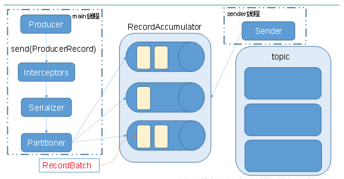
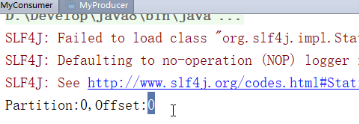
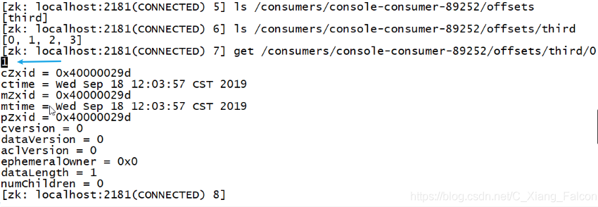
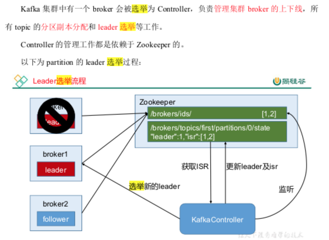
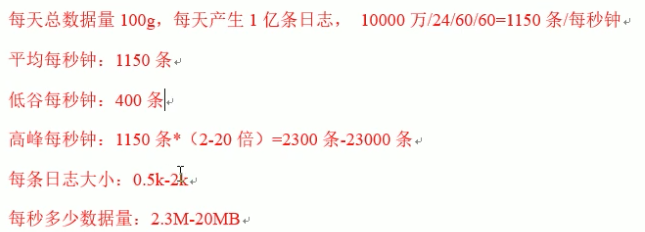

# 面试题

<font color=red>1.Kafka中的ISR(InSyncRepli)、OSR(OutSyncRepli)、AR(AllRepli)代表什么？</font>

<font color=gree>ISR : 速率和leader相差低于10秒的follower的集合</font>
<font color=gree>OSR : 速率和leader相差大于10秒的follower</font>
<font color=gree>AR : 所有分区的follower</font>

<font color=red>2.Kafka中的HW、LEO等分别代表什么？</font>

<font color=gree>HW: (High Water)，消费者能见到的最大的offset，ISR队列中最小的LEO</font>

<font color=gree>LEO: 每个分区副本最大的offset</font>

<font color=red>3.Kafka中怎么体现消息顺序性的？</font>

<font color=gree>区内有序，每个分区内，每条消息都有offset，所以只能同一分区内有序，不同的分区无法做到消息顺序性</font>

<font color=red>4.Kafka中的分区器、序列化器、拦截器是否了解？它们之间的处理顺序是什么？</font>

<font color=gree>拦截器>序列化器>分区器</font>

<font color=red>5.Kafka生产者客户端的整体结构是什么样子的？使用了几个线程来处理？分别是什么？</font>



<font color=red>6.“消费组中的消费者个数如果超过topic的分区，那么就会有消费者消费不到数据”这句话是否正确？</font>

<font color=gree>对的，超过分区数的消费者就不会再接收数据</font>

<font color=red>7.消费者提交消费位移时提交的是当前消费到的最新消息的offset还是offset+1?</font>

<font color=gree>offset + 1</font>



<font color=gree>生产者发送数据offset是从0开始的</font>



<font color=gree>消费者消费的数据offset是从offset+1开始的</font>

<font color=red>8.哪些情况会造成重复消费？</font>

<font color=gree>先处理数据再提交offset</font>

<font color=red>9.哪些情况会造成消息漏消费？</font>

<font color=gree>先提交offset后处理数据</font>

<font color=red>10.当你使用kafka-topics.sh创建（删除）了一个topic之后，Kafka背后会执行什么逻辑?</font>

<font color=gree>1）会在zookeeper中的/brokers/topics节点下创建一个新的topic节点，如：/brokers/topics/first</font>

<font color=gree>2）触发Controller的监听程序</font>

<font color=gree>3）kafka Controller负责topic的创建工作，并更新metadata cache</font>

<font color=red>11.topic的分区数可不可以增加？如果可以怎么增加？如果不可以，那又是为什么？</font>

<font color=gree>可以增加</font>

```java
bin/kafka-topics.sh --zookeeper localhost:2181/kafka --alter --topic topic-config --partitions 3
```

<font color=red>12.topic的分区数可不可以减少？如果可以怎么减少？如果不可以，那又是为什么？</font>

<font color=gree>不可以，先有的分区数据难以处理</font>

<font color=red>13.Kafka有内部的topic吗？如果有是什么?有什么作用？</font>

<font color=gree>__consumer_offset</font>

<font color=gree>给普通的消费者来存offset用的</font>

<font color=red>14.Kafka分区分配的概念？</font>

<font color=gree>1）Range：按topic来</font>

<font color=gree>2）Round-Robin：按组来消费</font>

<font color=red>15.简述Kafka的日志目录结构？</font>

<font color=gree>每一个分区对应一个文件夹,命名为topic-0,topic-1,每个文件夹内有.index和.log文件；首先通过二分查找法找到具体的index，然后通过index在log文件找到具体的变量</font>

<font color=red>16.如果我指定了一个offset，Kafka Controller怎么查找到对应的消息？</font>

<font color=gree>同15答案</font>

<font color=red>17.聊一聊kafka controller的作用？</font>

<font color=gree>负责kafka集群的上下线工作，所有topic的副本分区分配和选举leader工作</font>

<font color=red>18.kafka中有哪些地方需要选举？这些地方的选举策略又有哪些？</font>

<font color=gree>1）Controller</font>



<font color=gree>2）ISR</font>

<font color=gree>在ISR中需要选择，选择策略为先到先得</font>

<font color=red>19.失效副本是指什么？有哪些应对策略？</font>

<font color=gree>失效副本为速率比leader相差大于10秒的follower；将失效的follower先踢出ISR；等速率接近leader10秒内，再加进ISR</font>

<font color=red>20.Kafka的哪些设计让它有如此高的性能？</font>

<font color=gree>1）kafka是分布式的消息队列</font>

<font color=gree>2）(对于单节点)使用了顺序读写，速度可以达到600M/s</font>

<font color=gree>3）引用了zero拷贝，在os系统就完成了读写操作</font>

<font color=gree>4）对log文件进行了segment，并对segment建立了索引</font>

<font color=red>21.Kafka中数据量计算</font>



<font color=red>22.Kafka挂掉</font>

<font color=gree>1）Flume记录</font>

<font color=gree>2）日志有记录</font>

<font color=gree>3）短期没事</font>

<font color=red>23.Kafka消息数据积压，Kafka消费能力不足怎么处理？</font>


